# PICOTTY

### *Pico TeleTYpewriter* — an archaic telex reborn as an IP-reachable serial/HID KVM swarm

PICOTTY is a star-topology control plane for a fleet of Raspberry Pi Pico nodes.
Each node plugs into the USB port of a headless machine and becomes a **networked
keyboard with a serial return path** — it types keystrokes into its target and
reads the target's serial console back. One hub (a Raspberry Pi Zero 2 W)
coordinates the whole swarm and gives you a single browser dashboard to see every
node and drive it, reachable over your management network.

> **About the name.** A *TTY* is a teletypewriter — the archaic electromechanical
> terminal that typed on one end and printed what came back on the other, wired
> into switched **telex** networks. That is exactly what a PICOTTY node is: a tiny
> typewriter that keys into a machine and reads its console, networked to a central
> exchange. `Pico` + `TTY` (serial terminal) + IP networking + KVM duty = PICOTTY.

**This is not a video KVM.** There is no video capture. What you get is a fleet of
networked keyboards with an optional serial back-channel, coordinated and logged
centrally. Reading output depends on the target actually emitting to a serial
console — see [Considerations](#considerations).

---

## Dashboard

One page drives the whole swarm — serial console, macro editor, event log, and
settings. GitHub can't run JavaScript in a README, so this is a **Prev / Next
slideshow**: the ◀ / ▶ buttons jump between the five screens below.

<p align="center">
  <a name="shot-1"></a>
  <br>
  <sub><b>1 / 5 · Serial console</b> — live target output (ANSI-cleaned) with the HID ⇄ Serial input toggle</sub><br>
  <a href="#shot-5">◀ Prev</a> &nbsp;·&nbsp; <a href="#shot-2">Next ▶</a>
</p>

<p align="center">
  <a name="shot-2"></a>
  <br>
  <sub><b>2 / 5 · Macro editor</b> — build a reusable HID sequence from type / keys / wait steps</sub><br>
  <a href="#shot-1">◀ Prev</a> &nbsp;·&nbsp; <a href="#shot-3">Next ▶</a>
</p>

<p align="center">
  <a name="shot-3"></a>
  <br>
  <sub><b>3 / 5 · Macro library</b> — saved macros and their step sequence, replayable on any node</sub><br>
  <a href="#shot-2">◀ Prev</a> &nbsp;·&nbsp; <a href="#shot-4">Next ▶</a>
</p>

<p align="center">
  <a name="shot-4"></a>
  <br>
  <sub><b>4 / 5 · Event history</b> — every connect, command, and fault, timestamped</sub><br>
  <a href="#shot-3">◀ Prev</a> &nbsp;·&nbsp; <a href="#shot-5">Next ▶</a>
</p>

<p align="center">
  <a name="shot-5"></a>
  <br>
  <sub><b>5 / 5 · Settings</b> — heartbeat cadence, retention, token rotation, confirm-dangerous</sub><br>
  <a href="#shot-4">◀ Prev</a> &nbsp;·&nbsp; <a href="#shot-1">Next ▶</a>
</p>

---

## Table of contents

1. [What it is, in one paragraph](#what-it-is-in-one-paragraph)
2. [The plan](#the-plan)
3. [Physical topology](#physical-topology)
4. [Component itemization](#component-itemization)
5. [How a node uses one USB cable](#how-a-node-uses-one-usb-cable)
6. [The hub, inside](#the-hub-inside)
7. [The wire protocol](#the-wire-protocol)
8. [Message journeys](#message-journeys)
9. [Node firmware lifecycle](#node-firmware-lifecycle)
10. [Data model](#data-model)
11. [Repository layout](#repository-layout)
12. [End-to-end workflow](#end-to-end-workflow)
13. [Script execution reference](#script-execution-reference)
14. [Observability & debugging](#observability--debugging)
15. [Considerations](#considerations)
16. [Roadmap](#roadmap)

---

## What it is, in one paragraph

Each node opens a persistent TCP connection **out** to the hub's fixed address and
announces itself with an ID baked into its firmware. The hub keeps a live registry
of connected nodes in memory and a durable record in SQLite. A single Python
process on the hub runs two listeners on one asyncio event loop: a raw TCP server
facing the swarm (`:9000`), and a FastAPI app facing your browser over HTTP and
WebSocket (`:8080`). The browser holds no authoritative state — it loads the
current picture over REST, then live-updates from the WebSocket as nodes connect,
heartbeat, and return output. Commands you issue in the browser travel down the
same socket the node opened, and results come back up it.

| Component | Runs on | Initiates | Listens | Renders | Persists |
|---|---|---|---|---|---|
| Node firmware | Pico + W5100S | Outbound TCP to hub | Hub commands; target serial | Nothing | `/error.txt` (opt-in) |
| TCP server | Pi Zero (hub) | Nothing | Node connections `:9000` | Nothing | Writes DB on ingest |
| Registry | Pi Zero, in memory | — | — | — | No (rebuilt on connect) |
| DB layer | Pi Zero, SQLite | — | — | — | Yes |
| REST API | Pi Zero (FastAPI) | Writes to node sockets | Browser HTTP `:8080` | Nothing | Reads/writes DB |
| WebSocket hub | Pi Zero (FastAPI) | Pushes to browsers | Browser upgrades | Nothing | Reads DB on backfill |
| Dashboard | Your browser | Calls REST | WebSocket events | Everything | Local prefs only |

---

## The plan

PICOTTY is delivered in three layers, built and deployed in this order:

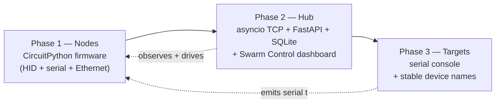

- **Phase 1 — Nodes.** Flash CircuitPython, deploy firmware, verify each node in
  isolation with a mock hub, then join it to the fleet.
- **Phase 2 — Hub.** Runs on the Pi Zero 2 W: listens for every node, records
  history, and serves the dashboard where you watch and drive the fleet.
- **Phase 3 — Targets.** Configure each managed machine to emit its serial console
  to its node, with a device name that survives reboots.

---

## Physical topology

The shape is a star. The hub sits at the center. Every node is a leaf with two
independent attachments: a USB cable to its target machine, and an Ethernet cable
to the management switch. Nothing connects node to node. Addresses below are
illustrative placeholders — use your own management subnet.

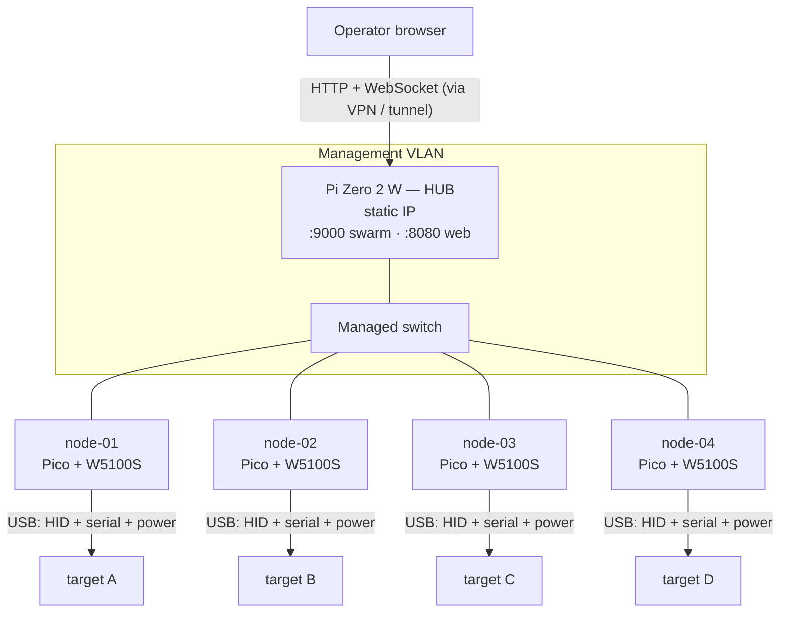

Two facts drive the whole design:

- **The node's Ethernet is on SPI, not USB.** The W5100S talks to the Pico over
  SPI, leaving the Pico's USB free to be a device presented to the target. That is
  what lets a node be a USB keyboard *and* reach the network at the same time.
- **One node per target.** No fan-out. Five machines means five nodes, five
  Ethernet drops, five IPs. The per-node cost is the real sizing driver.

Each node draws power from its target over the same USB cable that carries HID.
When the target is off, the node is off.

---

## Component itemization

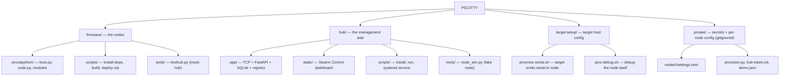

### Bill of materials

**Per node** — one set for each target machine you want to control:

| Component | Role | Qty | Notes |
|---|---|---|---|
| **Raspberry Pi Pico** (RP2040) — *or* **Pico 2** (RP2350) | Runs the CircuitPython node firmware; enumerates on the target as a USB keyboard + serial back-channel | 1 | Pico 2 is a drop-in — identical 40-pin layout and USB; just flash the **Pico 2** CircuitPython `.uf2` and stage libs for that build. Plain (non-W) boards are fine: the node is wired, so on-board Wi-Fi/BLE goes unused. |
| **WIZnet W5100S Ethernet HAT** | Wired Ethernet to the hub over **SPI**, keeping the Pico's USB free for the target | 1 | Seats on the Pico's 40-pin header (SPI0 + reset/interrupt). Driven by `adafruit_wiznet5k`. |
| **USB cable — data-capable** | Power **and** all three USB functions to the target, over the one cable | 1 | Micro-USB for Pico, USB-C for Pico 2. A charge-only cable powers the board but carries no HID/serial — a common gotcha. |
| **Ethernet patch cable** | Node → switch, on the management segment | 1 | |

> **All-in-one alternative:** the **WIZnet W5100S-EVB-Pico** integrates an RP2040 and the W5100S on a single board — it replaces the *Pico + HAT* pair with **no firmware changes**. Use it where you'd rather not stack a HAT.

**Hub** — one, shared by the whole swarm:

| Component | Role | Qty | Notes |
|---|---|---|---|
| **Raspberry Pi Zero 2 W** | Runs the hub: FastAPI dashboard, raw-TCP node server, SQLite history | 1 | Give it a **static IP** — nodes dial it by address. 64-bit Raspberry Pi OS installs the Python wheels (uvicorn/pydantic-core) most smoothly. Any always-on Linux box works too. |
| **microSD card** (8 GB+) | Hub OS + the SQLite database | 1 | |
| **USB power supply** | Powers the hub | 1 | |

**Fabric** — shared:

| Component | Role | Notes |
|---|---|---|
| **Managed switch / isolated VLAN** | Carries node↔hub TCP on an internal segment | The network boundary is **not** an authenticator — the node token still applies on every connection. |

**Sizing:** one Pico (+ HAT) and one Ethernet drop **per target machine**. A five-node swarm is five Picos, five HATs, five IPs, plus the single hub — the per-node cost is the real sizing driver.

Your real node ids, hub address, and token live only under `private/` (gitignored)
— nothing machine-specific is committed.

---

## How a node uses one USB cable

A node built with the default `boot.py` presents the target **three** USB
functions plus draws power — all over the single cable — while reaching the hub
over SPI Ethernet:

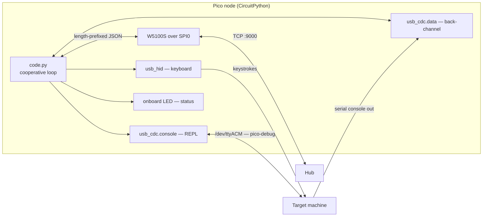

- **`usb_hid` keyboard** injects keystrokes (works everywhere a USB keyboard
  works: BIOS, bootloader, OS).
- **`usb_cdc.data`** is the clean serial back-channel the node reads the target's
  console from **and** writes into (the `send` command / dashboard Serial mode).
- **`usb_cdc.console`** is the CircuitPython REPL — a live debug view of the node
  itself, reachable from the target host via `pico-debug.sh`.

---

## The hub, inside

One Python program, one asyncio event loop, two faces sharing one registry and one
database. Run it under a **single** uvicorn worker — a second worker would get its
own registry and its own node sockets, and the two would disagree about who is
online.

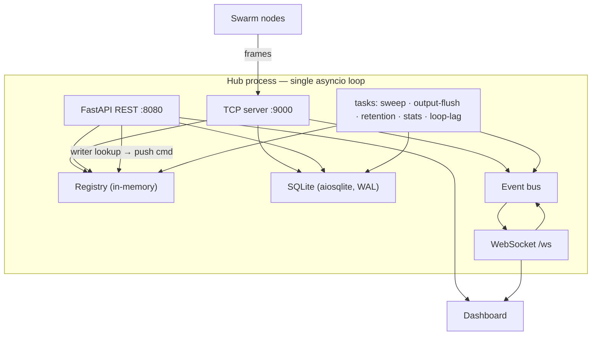

- The **TCP server** writes what nodes report (registrations, results, output,
  connect/disconnect). The **REST layer** writes what operators change (labels,
  notes, groups, macros, settings, the initial command row). Both read.
- The **registry** is the only shared mutable state, and it is small and
  rebuildable — on a hub restart it starts empty and refills as nodes reconnect.
- Serial **output** is subscription-scoped over the WebSocket (only browsers that
  have a node's console open receive it); everything else broadcasts. Slow clients
  get drop-oldest backpressure, never a stalled loop.

---

## The wire protocol

The `:9000` link is deliberately small: each message is a **4-byte big-endian
length** followed by that many bytes of **UTF-8 JSON**. Length-prefixing (not
newline-delimiting) means a body containing newlines or control characters needs
no escaping.

```
+----------------+--------------------------------+
| length (4 B)   | JSON body (length bytes)       |
+----------------+--------------------------------+
```

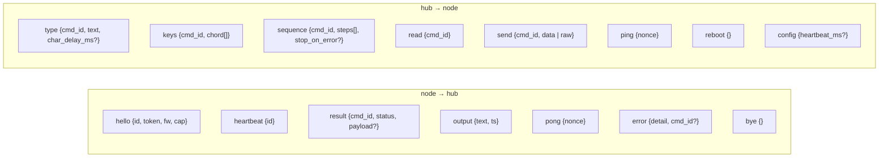

Every command carries a **`cmd_id`**; the node echoes it in the `result` and in any
`output` it can attribute to that command. This correlation is what lets the UI
match a result to the exact command that produced it, even when several commands
are in flight. The `token` in `hello` is a shared secret that stops a random device
on the VLAN from registering; it is a second line behind network isolation, not a
replacement for it.

---

## Message journeys

**A — A node comes online.**

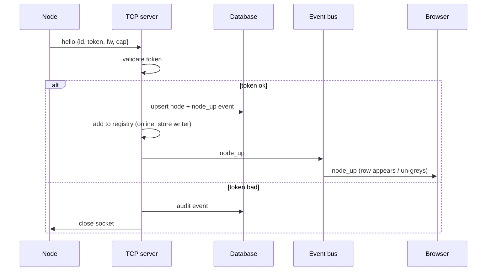

**B — An operator issues a command.**

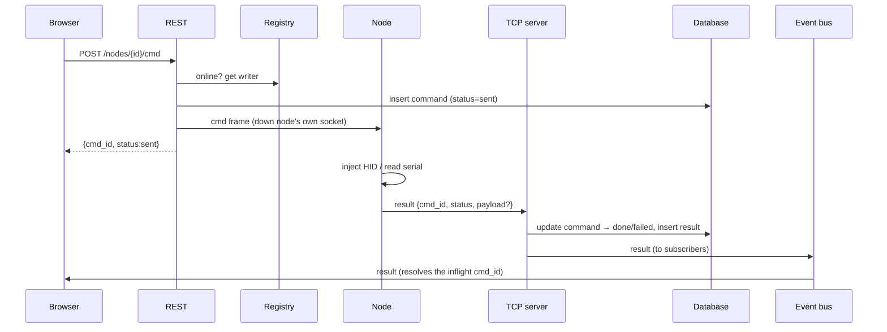

**C — The target emits serial output.**

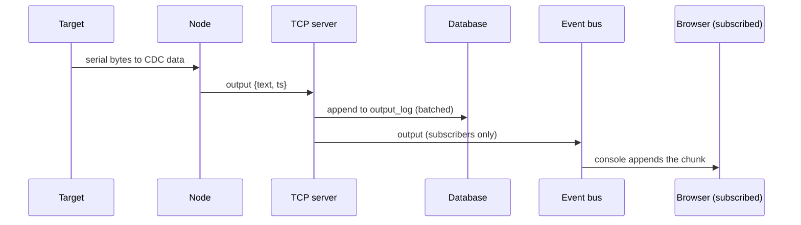

**D — Heartbeats and the liveness sweep.**

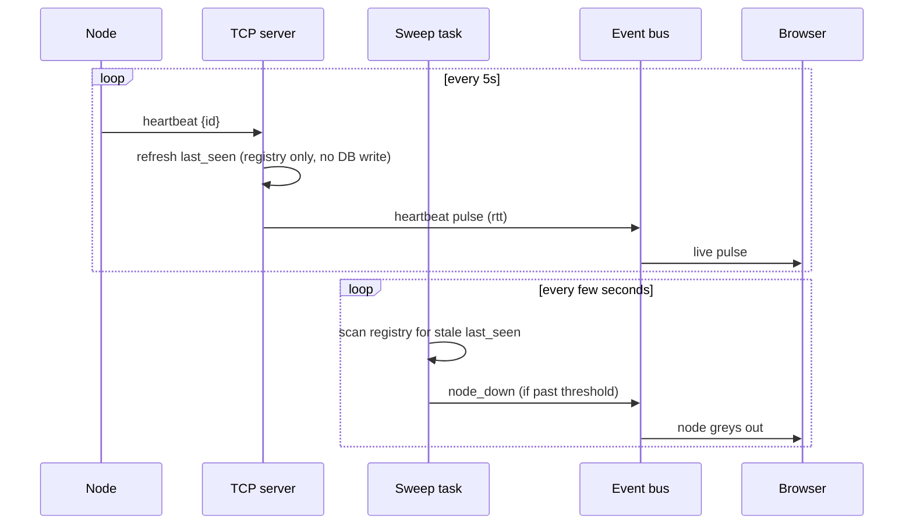

---

## Node firmware lifecycle

The firmware is a single cooperative loop with a hardware watchdog. The onboard
LED encodes the state so a headless node is readable at a glance.

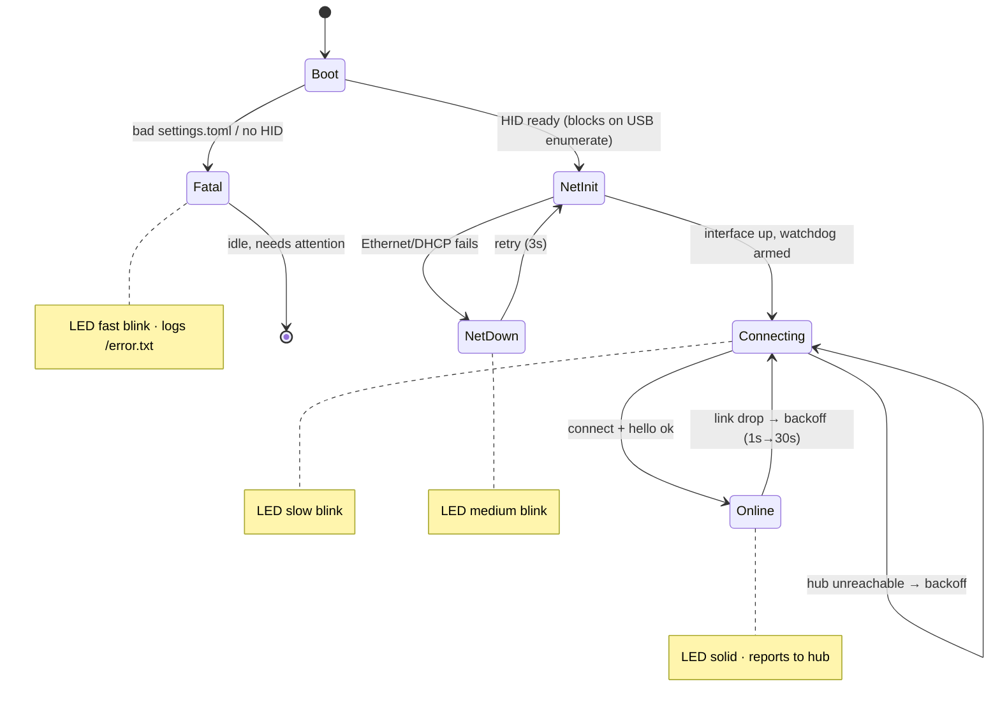

Key hardening: growing reconnect backoff, a bounded receive buffer, a per-loop cap
on forwarded output, non-blocking I/O throughout, a bounded connect timeout so a
down hub never hangs the loop, an ~8 s RP2040 watchdog (armed only after startup so
enumeration/DHCP don't false-trip it), and a unique MAC derived per node id.

---

## Data model

Two stores. The **registry** is in-memory, live, and disposable. The **database**
is SQLite, durable, and the record of truth for anything that must survive a
restart. WAL is on so reads don't block the ingest writer; output appends are
batched to protect SD-card throughput.

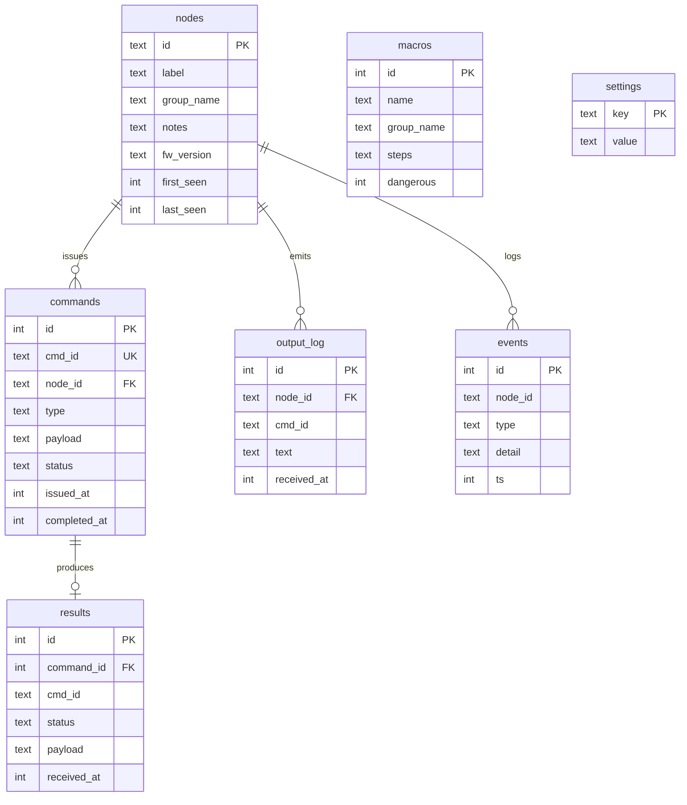

`output_log` and `events` are pruned on a daily schedule per their retention
settings; `commands`/`results` are kept longer; `nodes`/`macros` are never
auto-pruned. The registry holds `writer`, `last_seen`, `status`, `rtt_ms`, and
`inflight` per node — none of which is persisted.

---

## Repository layout

```
PICOTTY/
├── README.md                     ← this file
├── .gitignore                    ← ignores private/, hub/data/, firmware/build/
│
├── firmware/                     ← the nodes (CircuitPython)
│   ├── circuitpython/            ← boot.py, code.py, wire/netlink/injector/backchannel/
│   │                               nodeconfig/messages, settings.toml.example, README.md
│   ├── scripts/                  ← install-deps.sh, build.sh, deploy-zip.sh
│   ├── tools/                    ← testhub.py  (mock hub to test a node)
│   └── build/                    ← staged artifacts (gitignored)
│
├── hub/                          ← the management side (Python)
│   ├── app/                      ← main, config, protocol, registry, db, eventbus,
│   │                               core, tcp_server, tasks, api/{rest,ws,models}
│   ├── static/                   ← Swarm Control dashboard (index.html, app.js, styles)
│   ├── scripts/                  ← install.sh, run.sh, install-service.sh, swarm-hub.service
│   ├── tools/                    ← node_sim.py  (fake node to test the hub)
│   ├── data/                     ← hub.db (gitignored)
│   └── requirements.txt
│
├── target-setup/                 ← run ON a target machine
│   ├── proxmox-serial.sh         ← target emits its serial shell to the node
│   └── pico-debug.sh             ← open the node's REPL from the target host
│
└── private/                      ← secrets + per-node config (gitignored)
    ├── nodes/<id>/settings.toml
    ├── provision.py              ← stamp token into configs + seed the hub DB
    ├── hub-token.txt             ← shared node token (systemd EnvironmentFile)
    └── demo.json                 ← optional populated offline demo
```

---

## End-to-end workflow

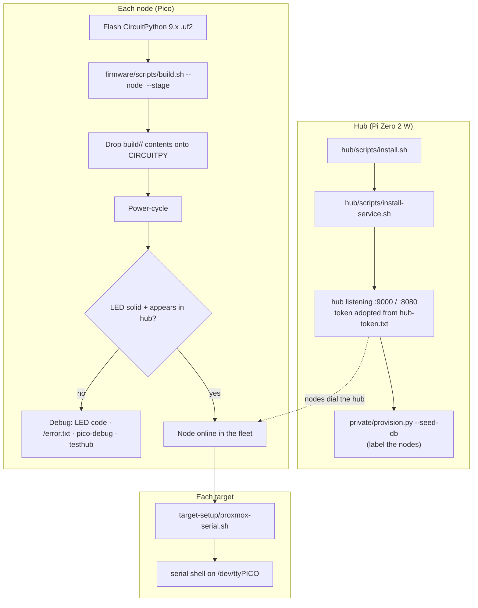

**Step by step:**

1. **Hub.** On the Zero 2 W: `bash hub/scripts/install.sh` then
   `bash hub/scripts/install-service.sh`. It adopts the shared token from
   `private/hub-token.txt` and starts listening. Optionally seed labels:
   `python3 private/provision.py --token <TOKEN> --seed-db hub/data/hub.db`.
2. **Bench-test a node.** Flash CircuitPython, build + deploy the firmware, point
   the node's `HUB_IP` at your laptop, and run
   `python3 firmware/tools/testhub.py --selftest` — confirm ping/read/config/
   heartbeat pass before it goes headless.
3. **Deploy nodes.** Set `HUB_IP` back to the hub's address, deploy, power-cycle.
   Each node dials the hub and appears in the dashboard.
4. **Configure targets.** On each managed machine run
   `target-setup/proxmox-serial.sh` so it emits its serial console to the node.
5. **Operate.** Open `http://<hub-ip>:8080`, pick a node, watch its console, and
   drive it (keys, chords, macros, bulk). Everything is logged.

---

## Script execution reference

All shell scripts are run with `bash <script>` (no chmod needed). Python tools run
with `python3`.

| Script | Run on | Purpose |
|---|---|---|
| `firmware/scripts/install-deps.sh` | flashing machine | Install `circup` + `mpy-cross` tooling. |
| `firmware/scripts/build.sh` | flashing machine | Deploy firmware to a mounted board (`--drive`) **or** build a drop-in artifact (`--stage`); installs Adafruit libs via circup; includes a node's `settings.toml` (`--node`). |
| `firmware/scripts/deploy-zip.sh` | flashing machine | Extract a staged `.zip` onto a `CIRCUITPY` drive (for a machine that only has the zip). |
| `firmware/tools/testhub.py` | any machine | Mock hub: exercise a real node's every command, interactively or `--selftest`. |
| `hub/scripts/install.sh` | hub (Pi) | apt deps + venv + `pip install -r requirements.txt`. |
| `hub/scripts/run.sh` | hub (Pi) | Run the hub in the foreground (loads `hub-token.txt`). |
| `hub/scripts/install-service.sh` | hub (Pi) | Install + enable + start the systemd service. |
| `hub/tools/node_sim.py` | any machine | Fake node: exercise the hub + dashboard with no hardware. |
| `private/provision.py` | anywhere | Stamp the token into node configs and seed the hub DB. |
| `target-setup/proxmox-serial.sh` | target host | Pin the node's serial device to `/dev/ttyPICO` + run a serial login shell. |
| `target-setup/pico-debug.sh` | target host | Open the node's CircuitPython REPL over USB (live debug). |

**Common invocations** (`<id>` = one of your node ids from `private/nodes/`):

```bash
# --- flashing a node ---
bash firmware/scripts/install-deps.sh
bash firmware/scripts/build.sh --node <id> --stage                # -> firmware/build/<id>/ + .zip
bash firmware/scripts/build.sh --node <id> --drive /run/media/$USER/CIRCUITPY   # direct
bash firmware/scripts/deploy-zip.sh firmware/build/<id>.zip       # on another machine
python3 firmware/tools/testhub.py --selftest                      # verify the node

# --- the hub ---
bash hub/scripts/install.sh
bash hub/scripts/install-service.sh
python3 hub/tools/node_sim.py --id <id> --token <TOKEN>           # test without hardware

# --- a target ---
sudo bash target-setup/proxmox-serial.sh            # emit serial to the node
sudo bash target-setup/pico-debug.sh                # debug the node itself
```

---

## Observability & debugging

Three concentric views, from a headless node outward to the whole fleet:

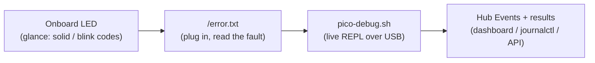

- **LED** — solid = connected & healthy; slow blink = up but not connected; medium
  blink = Ethernet problem; fast blink = fatal config/HID error.
- **`/error.txt`** — opt-in (`LOG_TO_FILE = "true"`): config/HID/Ethernet errors,
  watchdog-reset boots, and crashes, readable by plugging the Pico into a computer.
  Trade-off: the drive goes read-only over USB until you re-flash CircuitPython.
- **`pico-debug.sh`** — the node's REPL over its console USB channel: live
  `print()` output, tracebacks, and an interactive prompt (Ctrl-C / Ctrl-D).
- **The hub** — once connected, the node reports home: `node_up`/`node_down`,
  heartbeats + RTT, **error** events (including "recovered from watchdog reset"),
  and every command's `ok`/`failed` result with detail. Read it in the dashboard
  **Events** view, `journalctl -u swarm-hub -f`, or `GET /api/events`.

---

## Considerations

- **Network isolation is the real security boundary.** Both hub and nodes belong
  on an isolated management VLAN; reach the dashboard through a tunnel, never by
  exposing `:8080`. `:9000` must never be reachable from outside the segment. The
  `hello` token is a second line, not a substitute.
- **The target must talk.** A node can only read what the target *emits* to its
  serial port. Configure a serial console on the target (a getty and/or a
  bootloader/BIOS serial line) — `proxmox-serial.sh` does this for Proxmox-style
  Debian hosts. Where a target can't be configured, the node is a blind keyboard:
  you can type, you can't read.
- **HID input vs. serial input.** The console tab has two input modes, toggled
  per node. **HID mode** injects USB keystrokes (`type`/`keys`/macros); they land
  on the target's keyboard console — `tty1`, BIOS, GRUB — so it is the mode for
  firmware setup, bootloaders, and any target with no serial getty. **Serial
  mode** writes bytes straight into the target's serial line (the `send` command)
  and is the mode for an interactive **Linux serial login**: with a getty on the
  node's data port, keystrokes reach the login session and the getty echoes them
  back through the same channel, so passwords mask and typed characters appear
  with no local echo. The two are distinct sessions and line up only at
  BIOS/GRUB; at Linux runtime, HID drives `tty1` while Serial drives the getty.
  Serial mode is offered only for nodes whose firmware advertises the `serial_tx`
  capability; older firmware shows HID only.
- **The console is not a terminal emulator.** The console view is an append-only
  text log, not a VT: ANSI escape sequences (colors, cursor moves, full-screen
  TUIs like `top` or `vim`) render as their raw bytes rather than being
  interpreted. Serial mode is for shell interaction — logging in, running
  commands, reading output — not for curses applications.
- **CircuitPython version match.** `.mpy` libraries are per-major-version. Flash a
  9.x `.uf2` to match staged 9.x libs, or rebuild with `--cp-version 10.x`.
- **`console=True` keeps the debug port.** The default exposes the Pico's REPL as a
  second serial port (used by `pico-debug.sh`). The scripts disambiguate the two
  ports by USB interface number, so you don't need `console=False`.
- **One uvicorn worker.** The single event loop is the design.
- **Power.** A node is powered by its target's USB; when the target is off, the
  node is off. That's usually fine.

---

## Roadmap

- **Auth** is scaffolded but off by default (network-gated); enable it if you ever
  place the hub outside an isolated segment.

---

*PICOTTY — a teletype for machines that forgot they had a keyboard.*
