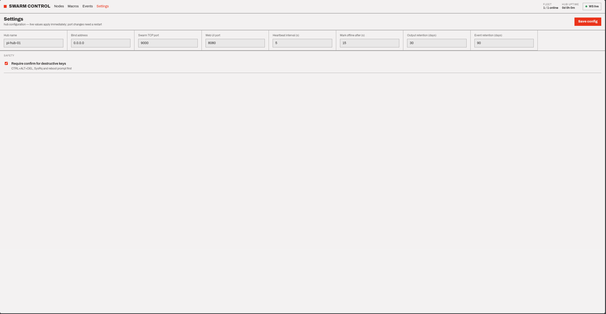
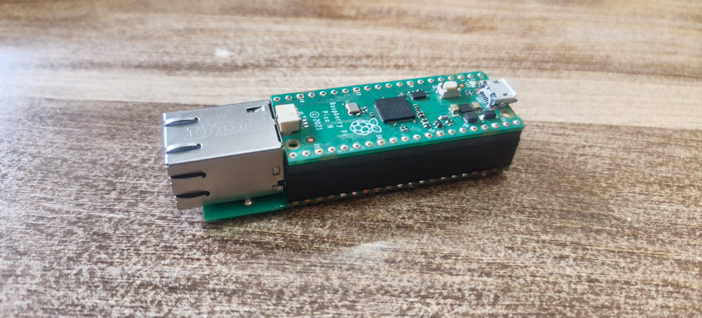
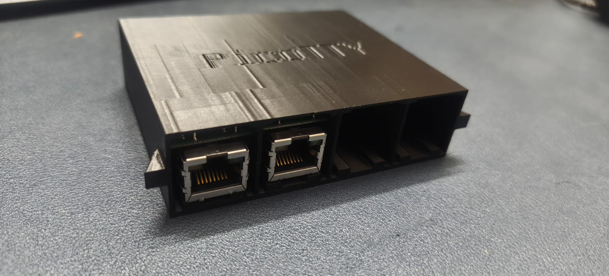
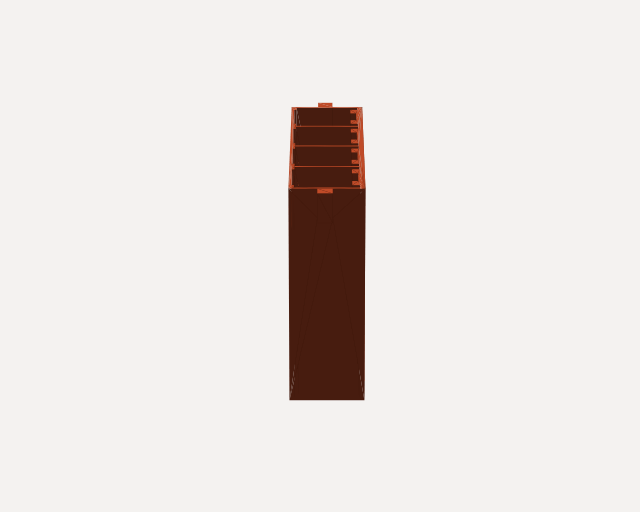

<p align="center">
  
</p>

# PICOTTY

*Pico TeleTYpewriter — an archaic telex reborn as a networked serial console.*

PICOTTY is a star-topology **serial console** for a fleet of Raspberry Pi Pico
nodes. Each node plugs into the USB port of a headless machine and becomes a
**networked serial console with keyboard injection** — it reads the target's
serial console back over the network and types keystrokes into the machine. One
hub (a Raspberry Pi Zero 2 W) coordinates the whole swarm and gives you a single
browser dashboard to watch every node and drive it, over your management network.

> **This is a serial console, not a KVM.** There is no video capture. Each node is
> a serial console with a USB keyboard attached: it reads what the target emits on
> its serial line and types back into it. Reading output therefore depends on the
> target actually having a serial console configured.

---

## The dashboard

One page drives the whole swarm. **Click any screenshot to open it at full resolution.**

<p align="center">
  <a href="pictures/Serial%20Panel.png"></a><br>
  <sub><b>Serial console</b> — live target output (ANSI-cleaned) with the HID ⇄ Serial input toggle</sub>
</p>

<table>
  <tr>
    <td width="50%" align="center"><a href="pictures/Macro%20Menu.png"></a><br><sub><b>Macro editor</b> — reusable HID sequences from type / keys / wait steps</sub></td>
    <td width="50%" align="center"><a href="pictures/Macro%20Selection.png"></a><br><sub><b>Macro library</b> — saved sequences, replayable on any node</sub></td>
  </tr>
  <tr>
    <td width="50%" align="center"><a href="pictures/Event%20History.png"></a><br><sub><b>Event history</b> — every connect, command, and fault, timestamped</sub></td>
    <td width="50%" align="center"><a href="pictures/Settings.png"></a><br><sub><b>Settings</b> — heartbeat, retention, token rotation, confirm-dangerous</sub></td>
  </tr>
</table>

---

## What you get

- **Networked serial consoles** — read each target's serial console live and type
  into its serial login (`send`), all from the browser over the network.
- **Keyboard injection** — each node is also a USB HID keyboard, so it drives the
  target everywhere a keyboard works: BIOS, GRUB, initramfs, the OS.
- **One dashboard** — live status, per-node console, keys/chords, macros, bulk
  commands, and an event log, over HTTP + WebSocket.
- **Durable history** — every node, command, result, and output chunk is recorded
  in SQLite on the hub.
- **Headless-friendly** — LED status codes, opt-in `/error.txt`, and a REPL debug
  path make a node with no monitor diagnosable.

---

## Hardware

Per target machine: a **Raspberry Pi Pico** (or **Pico 2**) + a **WIZnet W5100S
Ethernet HAT** + a data-capable USB cable + an Ethernet drop. One shared **Pi Zero
2 W** runs the hub. (The all-in-one **W5100S-EVB-Pico** replaces the Pico + HAT.)

<table>
  <tr>
    <td width="50%" align="center"><a href="pictures/Ethernet%20Hat.jpeg"></a><br><sub><b>WIZnet W5100S Ethernet HAT</b> — wired Ethernet over SPI</sub></td>
    <td width="50%" align="center"><a href="pictures/pico_hat_combo.jpeg"></a><br><sub><b>Pico + HAT</b> — SPI Ethernet, USB left free for the target</sub></td>
  </tr>
</table>

<p align="center">
  <a href="pictures/Assembly.jpeg"></a><br>
  <sub><b>A node assembled in its 3D-printed enclosure</b></sub>
</p>

### 3D-printable enclosure

<p align="center">
  <a href="https://3dviewer.net/#model=https://raw.githubusercontent.com/morpheuslord/PICOTTY/main/Enclosure%20Cad/Enclosure%20Body.stl"></a><br>
  <sub>▶ <b><a href="https://3dviewer.net/#model=https://raw.githubusercontent.com/morpheuslord/PICOTTY/main/Enclosure%20Cad/Enclosure%20Body.stl">Open the interactive 3D viewer</a></b> &nbsp;·&nbsp; or click <a href="Enclosure%20Cad/Enclosure%20Body.stl">the STL in the repo</a> for GitHub's built-in 3D viewer</sub>
</p>

Files in [`Enclosure Cad/`](Enclosure%20Cad):
[**STL**](Enclosure%20Cad/Enclosure%20Body.stl) (slice & print) ·
[STEP](Enclosure%20Cad/PICOTTY-ENCLOSURE.step) (neutral CAD) ·
[Fusion 360 (.f3d)](Enclosure%20Cad/PICOTTY-ENCLOSURE.f3d) (editable source)

→ Full bill of materials and topology: **[docs/hardware.md](docs/hardware.md)**

---

## Quick start

```bash
# 1. Hub — on the Pi Zero 2 W (adopts the token from private/hub-token.txt)
bash hub/scripts/install.sh
bash hub/scripts/install-service.sh          # or: bash hub/scripts/run.sh  (foreground)
#    → dashboard at  http://<hub-ip>:8080

# 2. Node — on your flashing machine (<id> = a node id under private/nodes/)
bash firmware/scripts/install-deps.sh
bash firmware/scripts/build.sh --node <id> --drive /run/media/$USER/CIRCUITPY
#    …or stage an artifact to drag on later:
bash firmware/scripts/build.sh --node <id> --stage        # -> firmware/build/<id>/ + .zip

# 3. Target — on each managed machine (emits its serial console to the node)
sudo bash target-setup/proxmox-serial.sh
```

**Test without hardware:**

```bash
python3 hub/tools/node_sim.py --id <id> --token <TOKEN>   # a fake node against the hub
python3 firmware/tools/testhub.py --selftest              # a mock hub against a real node
python3 firmware/tools/testhub.py --framecheck            # offline firmware framing checks
hub/.venv/bin/python hub/tests/test_db.py                 # offline hub db checks
```

Your node ids, hub address, and token live only under `private/` (gitignored) —
nothing machine-specific is committed.

---

## Documentation

The full technical reference lives in **[docs/](docs/)**:

| Doc | What's inside |
|---|---|
| [architecture.md](docs/architecture.md) | Component roles, the single-loop hub, the one-cable USB design, the wire protocol, message journeys, data model, repo layout |
| [hardware.md](docs/hardware.md) | Physical topology, bill of materials, component tree, sizing |
| [deployment.md](docs/deployment.md) | The three build phases, the end-to-end workflow, the full script reference |
| [firmware.md](docs/firmware.md) | Firmware lifecycle, LED codes, hardening, CircuitPython version rules |
| [operations.md](docs/operations.md) | Observability & debugging, HID vs Serial input, console limits |
| [considerations.md](docs/considerations.md) | Security boundary, target requirements, power, roadmap |

---

## Contributing & security

- [CONTRIBUTING.md](CONTRIBUTING.md) — dev setup, coding style, the "keep secrets out of the repo" rule
- [SECURITY.md](SECURITY.md) — reporting a vulnerability, operator hardening
- [CODE_OF_CONDUCT.md](CODE_OF_CONDUCT.md) — community expectations
- Licensed under the terms in [LICENSE](LICENSE).

---

*PICOTTY — a teletype for machines that forgot they had a keyboard.*
