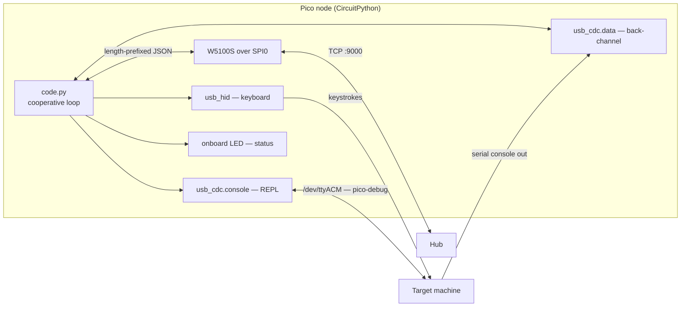
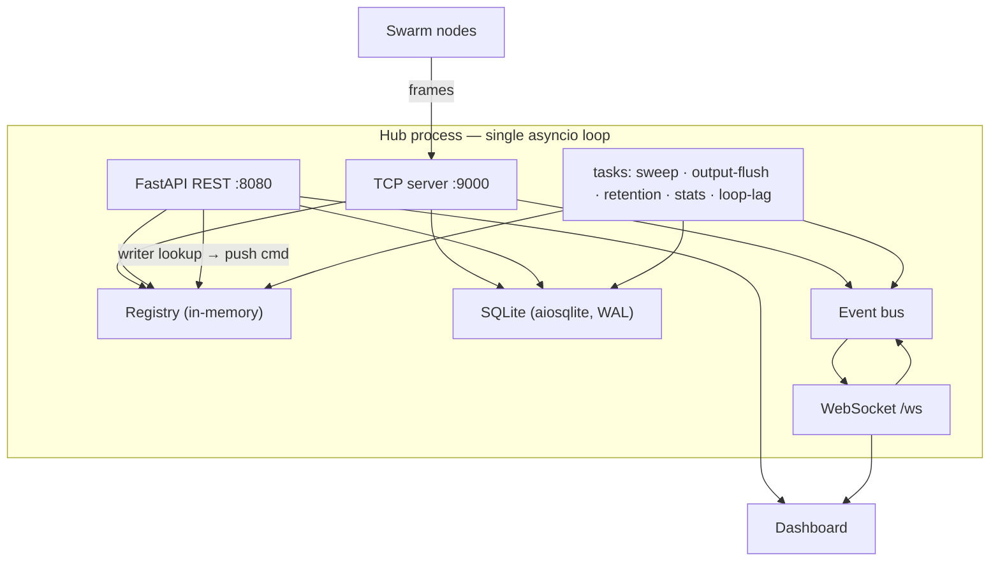
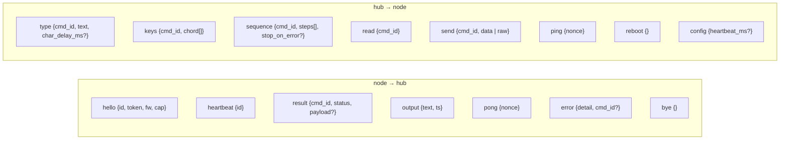
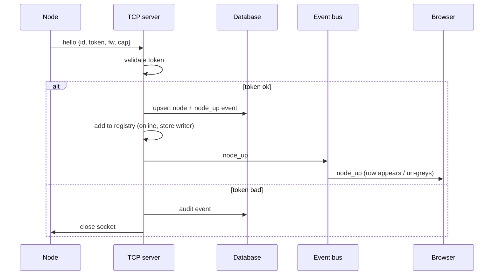
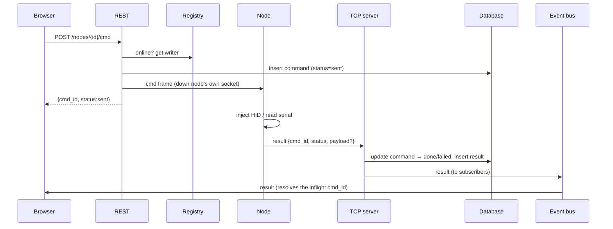
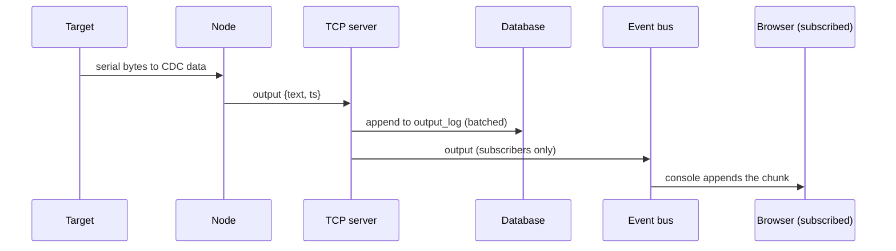
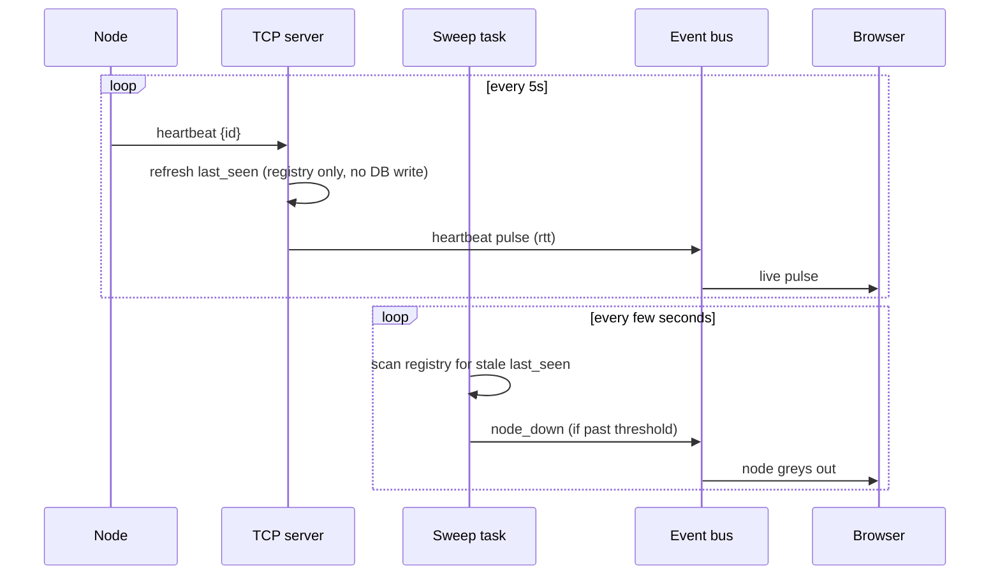
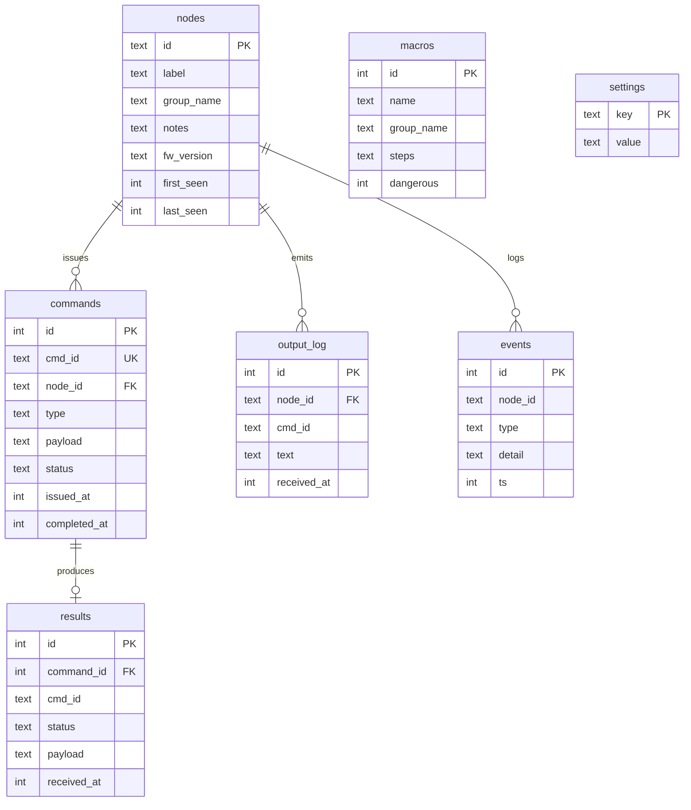

[← Docs index](README.md) · [← Project README](../README.md)

# Architecture

- [Component roles](#component-roles)
- [How a node uses one USB cable](#how-a-node-uses-one-usb-cable)
- [The hub, inside](#the-hub-inside)
- [The wire protocol](#the-wire-protocol)
- [Message journeys](#message-journeys)
- [Data model](#data-model)
- [Repository layout](#repository-layout)

## Component roles

Each node opens a persistent TCP connection **out** to the hub's fixed address and
announces itself with an ID baked into its firmware. The hub keeps a live registry
of connected nodes in memory and a durable record in SQLite. A single Python
process on the hub runs two listeners on one asyncio event loop: a raw TCP server
facing the swarm (`:9000`), and a FastAPI app facing your browser over HTTP and
WebSocket (`:8080`). The browser holds no authoritative state — it loads the
current picture over REST, then live-updates from the WebSocket as nodes connect,
heartbeat, and return output. Commands you issue in the browser travel down the
same socket the node opened, and results come back up it.

| Component | Runs on | Initiates | Listens | Renders | Persists |
|---|---|---|---|---|---|
| Node firmware | Pico + W5100S | Outbound TCP to hub | Hub commands; target serial | Nothing | `/error.txt` (opt-in) |
| TCP server | Pi Zero (hub) | Nothing | Node connections `:9000` | Nothing | Writes DB on ingest |
| Registry | Pi Zero, in memory | — | — | — | No (rebuilt on connect) |
| DB layer | Pi Zero, SQLite | — | — | — | Yes |
| REST API | Pi Zero (FastAPI) | Writes to node sockets | Browser HTTP `:8080` | Nothing | Reads/writes DB |
| WebSocket hub | Pi Zero (FastAPI) | Pushes to browsers | Browser upgrades | Nothing | Reads DB on backfill |
| Dashboard | Your browser | Calls REST | WebSocket events | Everything | Local prefs only |

## How a node uses one USB cable

A node built with the default `boot.py` presents the target **three** USB
functions plus draws power — all over the single cable — while reaching the hub
over SPI Ethernet:



- **`usb_hid` keyboard** injects keystrokes (works everywhere a USB keyboard
  works: BIOS, bootloader, OS).
- **`usb_cdc.data`** is the clean serial back-channel the node reads the target's
  console from **and** writes into (the `send` command / dashboard Serial mode).
- **`usb_cdc.console`** is the CircuitPython REPL — a live debug view of the node
  itself, reachable from the target host via `pico-debug.sh`.

## The hub, inside

One Python program, one asyncio event loop, two faces sharing one registry and one
database. Run it under a **single** uvicorn worker — a second worker would get its
own registry and its own node sockets, and the two would disagree about who is
online.



- The **TCP server** writes what nodes report (registrations, results, output,
  connect/disconnect). The **REST layer** writes what operators change (labels,
  notes, groups, macros, settings, the initial command row). Both read.
- The **registry** is the only shared mutable state, and it is small and
  rebuildable — on a hub restart it starts empty and refills as nodes reconnect.
- Serial **output** is subscription-scoped over the WebSocket (only browsers that
  have a node's console open receive it); everything else broadcasts. Slow clients
  get drop-oldest backpressure, never a stalled loop.

## The wire protocol

The `:9000` link is deliberately small: each message is a **4-byte big-endian
length** followed by that many bytes of **UTF-8 JSON**. Length-prefixing (not
newline-delimiting) means a body containing newlines or control characters needs
no escaping.

```
+----------------+--------------------------------+
| length (4 B)   | JSON body (length bytes)       |
+----------------+--------------------------------+
```



Every command carries a **`cmd_id`**; the node echoes it in the `result` and in any
`output` it can attribute to that command. This correlation is what lets the UI
match a result to the exact command that produced it, even when several commands
are in flight. The `token` in `hello` is a shared secret that stops a random device
on the VLAN from registering; it is a second line behind network isolation, not a
replacement for it.

## Message journeys

**A — A node comes online.**



**B — An operator issues a command.**



**C — The target emits serial output.**



**D — Heartbeats and the liveness sweep.**



## Data model

Two stores. The **registry** is in-memory, live, and disposable. The **database**
is SQLite, durable, and the record of truth for anything that must survive a
restart. WAL is on so reads don't block the ingest writer; output appends are
batched to protect SD-card throughput.



`output_log` and `events` are pruned on a daily schedule per their retention
settings; `commands`/`results` are kept longer; `nodes`/`macros` are never
auto-pruned. The registry holds `writer`, `last_seen`, `status`, `rtt_ms`, and
`inflight` per node — none of which is persisted.

## Repository layout

```
PICOTTY/
├── README.md                     ← the gist + copy-paste commands
├── docs/                         ← this technical reference
├── .gitignore                    ← ignores private/, hub/data/, firmware/build/
│
├── firmware/                     ← the nodes (CircuitPython)
│   ├── circuitpython/            ← boot.py, code.py, wire/netlink/injector/backchannel/
│   │                               nodeconfig/messages, settings.toml.example, README.md
│   ├── scripts/                  ← install-deps.sh, build.sh, deploy-zip.sh
│   ├── tools/                    ← testhub.py  (mock hub to test a node)
│   └── build/                    ← staged artifacts (gitignored)
│
├── hub/                          ← the management side (Python)
│   ├── src/picotty/              ← the picotty package (installed, console scripts)
│   │   ├── hub/                  ← main, config, registry, db, eventbus,
│   │   │                           core, tcp_server, tasks, api/{rest,ws,models}
│   │   ├── client/               ← client-side helpers
│   │   ├── protocol.py           ← wire protocol
│   │   ├── sim.py                ← fake node to test the hub (picotty-sim)
│   │   └── static/               ← Swarm Control dashboard (index.html, app.js, styles)
│   ├── scripts/                  ← install.sh, run.sh, install-service.sh, swarm-hub.service
│   ├── tests/                    ← offline checks (test_db.py)
│   ├── data/                     ← hub.db (gitignored)
│   ├── pyproject.toml            ← project + deps (picotty-hub / picotty-sim scripts)
│   └── uv.lock
│
├── target-setup/                 ← run ON a target machine
│   ├── proxmox-serial.sh         ← target emits its serial shell to the node
│   └── pico-debug.sh             ← open the node's REPL from the target host
│
└── private/                      ← secrets + per-node config (gitignored)
    ├── nodes/<id>/settings.toml
    ├── provision.py              ← stamp token into configs + seed the hub DB
    ├── hub-token.txt             ← shared node token (systemd EnvironmentFile)
    └── demo.json                 ← optional populated offline demo
```
