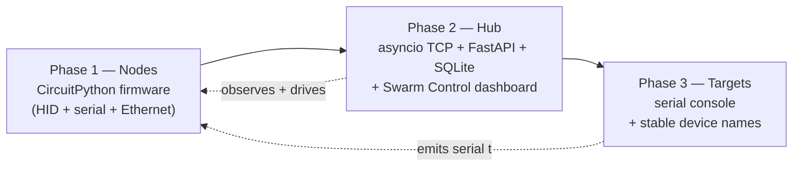
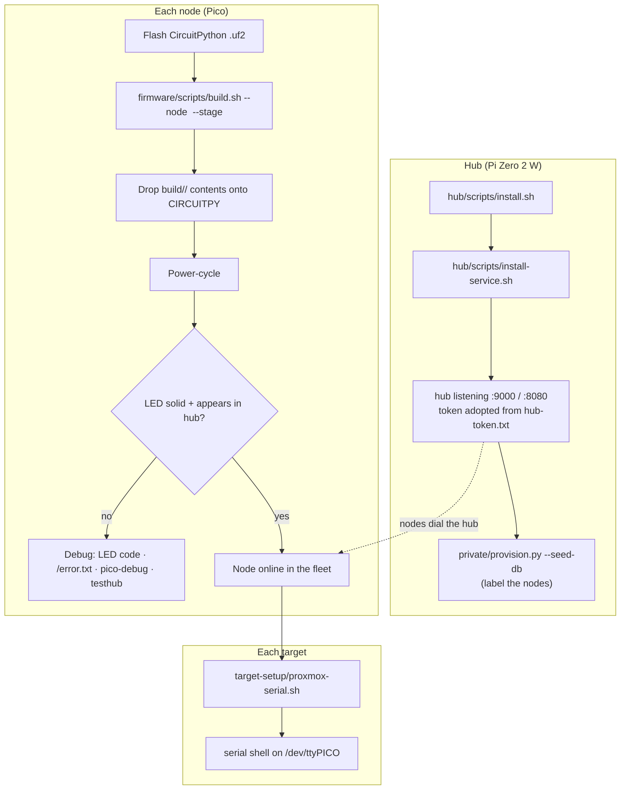

[← Docs index](README.md) · [← Project README](../README.md)

# Deployment

## The plan

PICOTTY is delivered in three layers, built and deployed in this order:



- **Phase 1 — Nodes.** Flash CircuitPython, deploy firmware, verify each node in
  isolation with a mock hub, then join it to the fleet.
- **Phase 2 — Hub.** Runs on the Pi Zero 2 W: listens for every node, records
  history, and serves the dashboard where you watch and drive the fleet.
- **Phase 3 — Targets.** Configure each managed machine to emit its serial console
  to its node, with a device name that survives reboots.

## End-to-end workflow



**Step by step:**

1. **Hub.** On the Zero 2 W: `bash hub/scripts/install.sh` then
   `bash hub/scripts/install-service.sh`. It adopts the shared token from
   `private/hub-token.txt` and starts listening. Optionally seed labels:
   `python3 private/provision.py --token <TOKEN> --seed-db hub/data/hub.db`.
2. **Bench-test a node.** Flash CircuitPython, build + deploy the firmware, point
   the node's `HUB_IP` at your laptop, and run
   `python3 firmware/tools/testhub.py --selftest` — confirm ping/read/config/
   heartbeat pass before it goes headless. (`--framecheck` runs the framing unit
   checks with no hardware at all.)
3. **Deploy nodes.** Set `HUB_IP` back to the hub's address, deploy, power-cycle.
   Each node dials the hub and appears in the dashboard.
4. **Configure targets.** On each managed machine run
   `target-setup/proxmox-serial.sh` so it emits its serial console to the node.
5. **Operate.** Open `http://<hub-ip>:8080`, pick a node, watch its console, and
   drive it (keys, chords, macros, bulk). Everything is logged.

## Optional: a backup hub

For failover, stand up a **second hub** and point boards at it. The two hubs are
independent (own DB each) and share only the node token:

1. Install the backup hub exactly like the primary, but give it a **distinct
   `HUB_ID`** (`HUB_ID=hub-backup picotty-hub`) so you can tell them apart.
2. Set the **same node token** on both hubs (its `node_token_hash` must match), so
   either can authenticate the same board.
3. On each node's `settings.toml`, point `HUB_IP_BACKUP` at the backup hub. Nodes
   prefer the primary and fail over to the backup when it's unreachable.
4. On **both** hubs, set **`HUB_PEERS`** to the *other* hub's base URL (e.g.
   `HUB_PEERS=http://192.168.1.169:8080` on the primary, and the primary's URL on
   the backup). This enables cross-hub takeover and peer visibility: each hub shows
   boards held by its peer as "active on `<peer>`", and steering a board a hub
   doesn't hold relays the directive to the peer that does — so you can pull a
   board across from either dashboard. Peer calls carry no auth, so this assumes a
   trusted management VLAN.

The **Telegram sidecar** can run on both hosts too: set `HUB_BASE_URL_BACKUP` so
the bot fails over between hubs, but keep only **one** unit enabled at a time
(Telegram allows one active receiver per bot token) — the other is a hot spare.

Full model, runtime steering, and token setup: **[dual-hub.md](dual-hub.md)**.

## Script execution reference

All shell scripts are run with `bash <script>` (no chmod needed). Python tools run
with `python3`.

| Script | Run on | Purpose |
|---|---|---|
| `firmware/scripts/install-deps.sh` | flashing machine | Install `circup` + `mpy-cross` tooling. |
| `firmware/scripts/build.sh` | flashing machine | Deploy firmware to a mounted board (`--drive`) **or** build a drop-in artifact (`--stage`); installs Adafruit libs via circup; includes a node's `settings.toml` (`--node`). Staged library version defaults to CircuitPython 10.2.1 — override with `--cp-version`. |
| `firmware/scripts/deploy-zip.sh` | flashing machine | Extract a staged `.zip` onto a `CIRCUITPY` drive (for a machine that only has the zip). |
| `firmware/tools/testhub.py` | any machine | Mock hub: exercise a real node's every command, interactively or `--selftest`; `--framecheck` runs offline framing unit checks. |
| `hub/scripts/install.sh` | hub (Pi) | `uv sync --extra hub` (creates `hub/.venv`) + fetches the terminal libs. |
| `hub/scripts/run.sh` | hub (Pi) | Run the hub in the foreground (loads `hub-token.txt`). |
| `hub/scripts/install-service.sh` | hub (Pi) | Install + enable + start the systemd service. |
| `picotty-sim` (packaged simulator) | any machine | Fake node: exercise the hub + dashboard with no hardware. |
| `hub/tests/test_db.py` | any machine | Offline SQLite checks for the hub's data layer. |
| `private/provision.py` | anywhere | Stamp the token into node configs and seed the hub DB. |
| `target-setup/proxmox-serial.sh` | target host | Pin the node's serial device to `/dev/ttyPICO` + run a serial login shell. |
| `target-setup/pico-debug.sh` | target host | Open the node's CircuitPython REPL over USB (live debug). |

**Common invocations** (`<id>` = one of your node ids from `private/nodes/`):

```bash
# --- flashing a node ---
bash firmware/scripts/install-deps.sh
bash firmware/scripts/build.sh --node <id> --stage                # -> firmware/build/<id>/ + .zip
bash firmware/scripts/build.sh --node <id> --drive /run/media/$USER/CIRCUITPY   # direct
bash firmware/scripts/deploy-zip.sh firmware/build/<id>.zip       # on another machine
python3 firmware/tools/testhub.py --selftest                      # verify the node
python3 firmware/tools/testhub.py --framecheck                    # offline framing checks

# --- the hub ---
bash hub/scripts/install.sh
bash hub/scripts/install-service.sh
uv run picotty-sim --id <id> --token <TOKEN>                      # test without hardware
hub/.venv/bin/python hub/tests/test_db.py                         # offline db checks

# --- a target ---
sudo bash target-setup/proxmox-serial.sh            # emit serial to the node
sudo bash target-setup/pico-debug.sh                # debug the node itself
```
