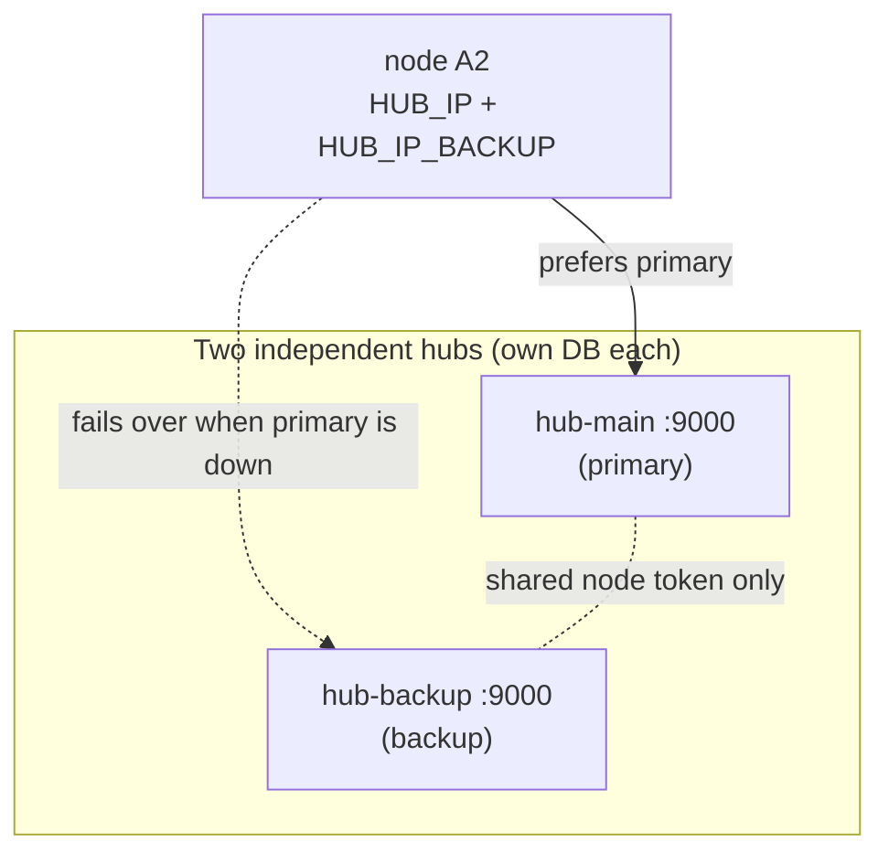

[← docs index](README.md)

# Dual-hub failover

Give a node a **primary** and a **backup** hub. The node prefers the primary,
fails over to the backup when the primary is unreachable, and either hub can
drive the board. A hub — the dashboard today, an app tomorrow — can also **steer**
a board at runtime: move it to the other hub, or promote the backup to be its new
home. It is the lights-out-management equivalent of a second power feed.

## The model: independent peers, one connection at a time

The two hubs are **independent**. Each runs its own process and its own SQLite
database; they do **not** replicate state. They share exactly one thing: the
**node token**, so either can authenticate the same board.



A board holds **exactly one** connection at a time, so there is no split-brain
and no coordination between hubs. What this buys you and what it doesn't:

- **Fails over:** the live control connection moves to the backup. You keep full
  control of the board from the backup's dashboard/API/bot.
- **Does not move with the board:** per-hub data — queued commands, session
  recordings, OTA jobs, command history, alert settings — stays on the hub that
  recorded it. Each hub shows only the boards currently connected to *it*.

If you need history that spans both hubs, export/read it from each; there is no
merge. This is deliberate — a homelab backup hub should be simple and reliable,
not a distributed database.

## Node configuration

In the node's `settings.toml` (see
[settings.toml.example](../firmware/circuitpython/settings.toml.example)):

```toml
HUB_IP = "10.20.0.10"          # primary (required, as before)
HUB_PORT = 9000

HUB_IP_BACKUP = "10.20.0.11"   # backup — set this to enable failover
HUB_PORT_BACKUP = 9000

# Optional labels, shown on the dashboard / in Telegram and used as the target
# name when you steer a board. Defaults: "primary" / "backup".
HUB_LABEL = "primary"
HUB_LABEL_BACKUP = "backup"

# Failback policy after a failover:
#   sticky     (default) stay on whichever hub is working — never interrupts a
#              live session. Move back manually when you want.
#   preemptive retry the most-preferred hub first on every reconnect, so a
#              recovered primary is used again on the next reconnect.
HUB_FAILBACK = "sticky"

HUB_FAILOVER_TRIES = 2         # connect failures before rotating to the other hub
```

Leave `HUB_IP_BACKUP` unset and the node behaves exactly as a single-hub node —
this change is fully backward compatible.

**Both hubs must share the node token.** `NODE_TOKEN` on the board must match the
`node_token_hash` on *both* hubs (see [below](#sharing-the-node-token)). And both
hubs ping their nodes by default (`HUB_NODE_PING_INTERVAL_MS`), which the node's
`HUB_TIMEOUT_MS` relies on — so don't disable pinging on the backup.

## How the node chooses (the selector)

The node's `HubSelector`
([hubselect.py](../firmware/circuitpython/hubselect.py)) keeps an ordered list of
hubs and points the transport at the chosen one before each connect:

- **Boot / normal:** dial the primary.
- **Primary unreachable:** after `HUB_FAILOVER_TRIES` failed connects, rotate to
  the backup.
- **Sticky (default):** once a hub accepts the board, keep using it across benign
  drops. A recovered primary does **not** yank a live session back.
- **Dead-hub detection:** if the connected hub goes silent past `HUB_TIMEOUT_MS`,
  the node drops it and reconnects (retrying the same hub first, then rotating).

Failover triggers are the same signals the node already used for reconnect —
there is no extra polling and no second socket (the WIZnet chip has only four).

## Steering a board at runtime

Each hub advertises its identity to a board right after it connects (a `welcome`
frame carrying the hub's `HUB_ID`), so the board always knows **which hub it is
talking to**. An authenticated hub can then send the board a directive:

| Action | Effect |
|---|---|
| **switch** | Move to the target hub **now** (one-shot; preference unchanged — a later failover still prefers the primary). |
| **prefer** | Make the target the board's **preferred/home** hub **and** move now. Persisted — this is "use my backup as my main". |
| **pin** | Lock the board to the target hub, ignoring failover, and move now. Persisted. |
| **unpin** | Release a pin; normal failover resumes. |

The target must be one of the board's **configured** hubs, so a hub can never
redirect a board to an arbitrary address. `prefer`/`pin` persist to
`/hub_pref.json` on the board so they survive a soft reload (best-effort: on a
read-only filesystem — the default without OTA — the override holds for the life
of the process instead).

Drive it three ways:

- **Dashboard:** each node's **Hub** control (Move / Set-as-home / Pin / Unpin).
- **REST:** `POST /api/nodes/{id}/hub` with `{"action": "...", "target": "..."}`.
- **Telegram:** `/hubs` shows which hub each board is on; `/hub <node>
  <switch|prefer|pin|unpin> [target]` steers it (armed / break-glass gated).

## Driving a board from *either* hub (peer relay)

A board holds exactly one hub connection at a time, so only the hub that
currently **holds** the board can push it a frame. That means a plain single hub
can't steer — or even see — a board that's connected to the *other* hub: to the
backup, a board living on the primary just looks offline.

Point each hub at the other with **`HUB_PEERS`** (a comma-separated list of the
other hubs' base URLs) and both gaps close:

```bash
HUB_ID=hub-main    HUB_PEERS=http://192.168.1.169:8080  picotty-hub   # primary knows the backup
HUB_ID=hub-backup  HUB_PEERS=http://192.168.1.174:8080  picotty-hub   # backup knows the primary
```

With peers configured:

- **Peer visibility.** Each hub polls its peers' rosters, so a board live on the
  other hub shows in the list as **"active on `<peer>`"** (a purple badge) instead
  of missing/offline — even for a board this hub has never seen. You know it's up
  and where.
- **On-demand takeover from either hub.** When you steer a board the hub doesn't
  hold, the directive is **relayed** to the peer that does hold it, which delivers
  it — the board then switches over to you. So you can stand at the **backup's**
  dashboard, hit **Move / Set-as-home** on a board that's on the primary, and pull
  it across. (A relayed call is never relayed again, so peers can't loop.)

`HUB_PEERS` assumes a **trusted management VLAN** — peer calls carry no auth,
matching the node-token posture. Leave it unset for a standalone hub; failover
and holding-hub steering still work, you just can't steer/see a board from the
hub that isn't holding it.

## Sharing the node token

The board authenticates with the same `NODE_TOKEN` on every hub, so both hubs
must hold the matching `node_token_hash`. Set it up once:

1. On the primary, note or rotate the node token (dashboard **Settings → rotate
   node token**, or `POST /api/settings/token/rotate`). Flash the token into every
   board's `settings.toml` as `NODE_TOKEN`.
2. On the backup, set the **same** token so its `node_token_hash` matches. The
   simplest path is to point the backup at the same value during install; if you
   rotate later, rotate on both or copy the hash across.

Give each hub a distinct name so you can tell them apart:

```bash
HUB_ID=hub-main    picotty-hub   # primary
HUB_ID=hub-backup  picotty-hub   # backup
```

`HUB_ID` is shown on the dashboard and sent to boards in the welcome frame; it
defaults to the host's name.

## What it looks like end to end

1. Board boots, dials `hub-main`, registers, gets `welcome{hub_id: hub-main}`.
2. `hub-main` loses power. The board's connects fail; after
   `HUB_FAILOVER_TRIES` it dials `hub-backup`, registers there, and you keep
   working from the backup — sticky, so it stays put when `hub-main` returns.
3. You decide the backup should be home: from the backup's dashboard (or `/hub A2
   prefer backup`) you promote it. The board persists the preference; future
   failovers now prefer `hub-backup`.

## The Telegram sidecar in a dual-hub setup

The phone control plane should survive a hub outage too, so the sidecar is
dual-hub aware.

### The bot fails over between hubs

Give the sidecar a backup hub and it prefers the primary, failing over to the
backup if the primary is unreachable — every REST call and the live event stream
follow whichever hub is up:

```ini
# in ~/.config/picotty/telegram.env
HUB_BASE_URL=http://192.168.1.174:8080          # primary
HUB_BASE_URL_BACKUP=http://192.168.1.169:8080   # backup
```

Pick which hub the bot **acts on** from chat:

- **`/source`** — show the two hubs and which one is active.
- **`/source primary`** / **`/source backup`** — switch the bot to that hub. (It
  still auto-fails-over if that hub later goes down.)

So `/source` chooses your **source/fleet**, while `/hub <node> …` (armed) steers
an individual **board** between hubs.

### Running a sidecar on both hosts (one active)

Telegram allows only **one active receiver per bot token** — two processes polling
the same token conflict and drop messages. So run the **same** bot on both hosts
but keep only **one enabled** at a time; the other is a hot spare:

```bash
# on BOTH hosts: install with the SAME telegram.env (token, allowlist, both hubs)
bash telegram-bot/scripts/install.sh

# host A (the one you run day to day): make it the live bot
bash telegram-bot/scripts/install-service.sh    # enables + starts swarm-telegram

# host B (the spare): install the unit but leave it OFF
sudo systemctl disable --now swarm-telegram
```

If host A dies, promote the spare with one command on host B:

```bash
sudo systemctl enable --now swarm-telegram
```

The live bot already reaches **both** hubs (via `HUB_BASE_URL_BACKUP`) and you pick
the source with `/source`, so a single active bot covers the whole fleet — the
second host is purely for surviving the loss of the first host.

## See also

- [architecture.md](architecture.md) — the wire protocol and the node/hub loop.
- [firmware.md](firmware.md) — node lifecycle, LED codes, settings.
- [telegram.md](telegram.md) — the `/hubs` and `/hub` commands in context.
