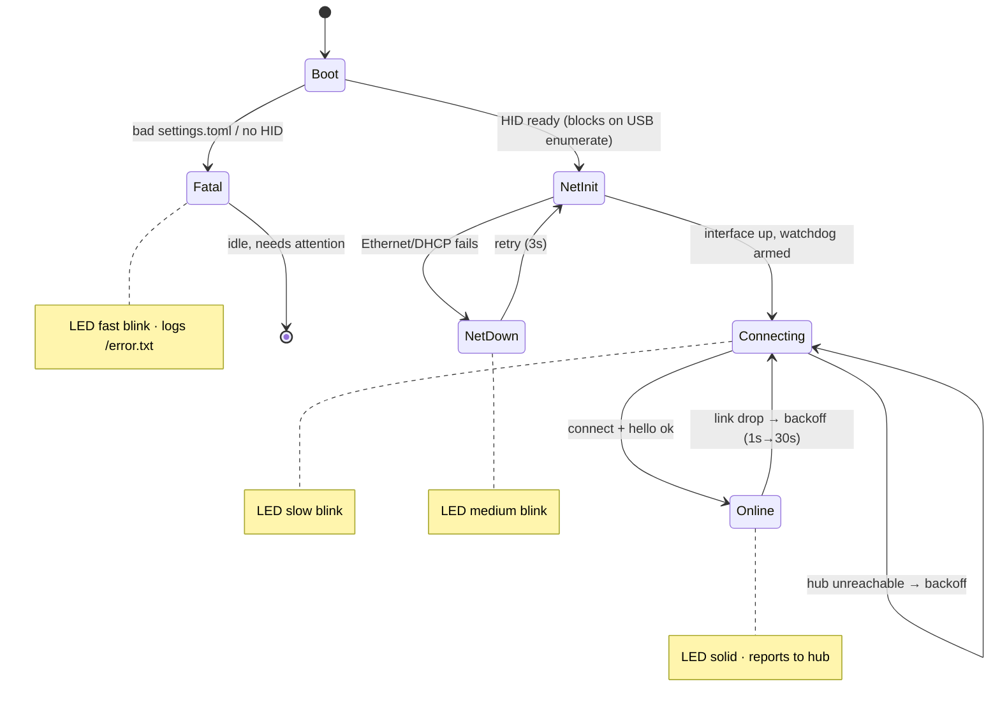

[← Docs index](README.md) · [← Project README](../README.md)

# Node firmware

## Lifecycle

The firmware is a single cooperative loop with a hardware watchdog. The onboard
LED encodes the state so a headless node is readable at a glance.

Key hardening: growing reconnect backoff, a bounded receive buffer, a per-loop cap
on forwarded output, non-blocking I/O throughout, a bounded connect timeout so a
down hub never hangs the loop, an ~8 s RP2040 watchdog (armed only after startup so
enumeration/DHCP don't false-trip it), and a unique MAC derived per node id.

## LED status codes

| Pattern | Meaning |
|---|---|
| Solid on | Connected to the hub, healthy |
| Slow blink | Powered + networked, but not connected to the hub (retrying) |
| Medium blink | Ethernet/link problem (cannot bring the network up) |
| Fast blink | Fatal config or HID error — needs attention; also logs `/error.txt` |

## CircuitPython version rules

- **`.mpy` libraries are per-major-version.** A node running CircuitPython 10.x
  must have 10.x libraries; 9.x `.mpy` files fail to import and crash-loop the
  node. When you deploy directly to a board (`build.sh --drive`), circup reads the
  board's real version and fetches the matching bundle automatically. When you
  **stage** offline (`--stage`), there's no board to read, so `build.sh` uses
  `--cp-version` (default **10.2.1**) to pick the bundle — override it if a board
  runs a different version.
- **`console=True` keeps the debug port.** The default `boot.py` exposes the
  Pico's REPL as a second USB serial port (used by `pico-debug.sh`). The
  target-setup scripts disambiguate the two CDC ports by USB interface number, so
  you don't need `console=False` in production.
- **`LOG_TO_FILE` trade-off.** Turning on `/error.txt` logging makes the firmware
  remount the filesystem writable to CircuitPython, which makes the `CIRCUITPY`
  drive **read-only over USB** — drag-drop redeploys stop working until you turn it
  off (and hard-reset) or re-flash. Leave it off unless chasing a fault.
