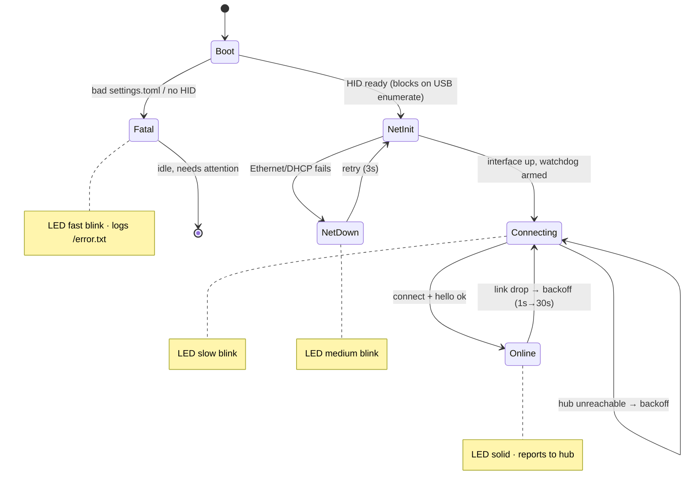

[← Docs index](README.md) · [← Project README](../README.md)

# Node firmware

## Lifecycle

The firmware is a single cooperative loop with a hardware watchdog. The onboard
LED encodes the state so a headless node is readable at a glance.

Key hardening: growing reconnect backoff, a bounded receive buffer, a per-loop cap
on forwarded output, non-blocking I/O throughout, a bounded connect timeout so a
down hub never hangs the loop, an ~8 s RP2040 watchdog (armed only after startup so
enumeration/DHCP don't false-trip it), and a unique MAC derived per node id.

## LED status codes

| Pattern | Meaning |
|---|---|
| Solid on | Connected to the hub, healthy |
| Slow blink | Powered + networked, but not connected to the hub (retrying) |
| Medium blink | Ethernet/link problem (cannot bring the network up) |
| Fast blink | Fatal config or HID error — needs attention; also logs `/error.txt` |

## Keyboard layout

The node types into the target as a USB HID keyboard, and the mapping from a
character to a keycode is **layout-specific** — it lives in the Adafruit layout
object *on the node*, not on the hub. A node hardcoded to US typing into a target
set to a German/UK/French layout mistypes symbols (the classic "my password has a
`/` and the node typed `-`" bug). So layout is a per-node firmware setting, not
something the hub can translate.

- Set `KEYBOARD_LAYOUT` in the node's `settings.toml` to the code the target
  expects (`us`, `de`, `uk`, `fr`, …). **Default `us`**; an absent setting keeps a
  node typing exactly as before, so old configs are unaffected.
- `us` (or unset/`en`/`en_us`) uses the built-in `KeyboardLayoutUS`. Any other
  code lazily imports the matching community library (`keyboard_layout_win_<code>`,
  which pairs with its own `keycode_win_<code>`). If that library isn't staged on
  the board, the node **logs a warning and falls back to US** rather than failing —
  a misconfigured layout degrades to a working keyboard, never a fatal HID error.
  Make sure the layout library the node needs is installed in its `lib/`.
- The node reports its **active, resolved** layout in `hello` (e.g. `"layout":"de"`,
  or `"us"` if a requested layout fell back). The hub keeps it as **read-only**
  node detail (`layout` on `GET /api/nodes/{id}`) so an operator can see at a glance
  what each node is set to; old firmware omits it and the hub treats that as `us`.

Only the literal-text (`type` / `send`-as-text) path is layout-sensitive; the
named-chord path (`keys`, e.g. `CTRL+C`) maps to keycodes directly and is
unaffected.

## OTA capability

`firmware/circuitpython/otaflash.py` implements over-the-wire firmware updates —
a chunked, SHA-256-verified file push with a `.bak` backup and an automatic
watchdog-revert so a bad update self-reverts on the next reset. It is **fully
wired into the running firmware**: `code.py` imports it, advertises the `ota`
capability (gated on `OTA_ENABLED` plus a writable filesystem and `adafruit_hashlib`),
dispatches `ota_begin`/`ota_chunk`/`ota_commit`, and finalizes on a healthy
heartbeat; `boot.py` calls its boot-time recovery; the `OTA_ENABLED` setting and
the hub-side push path (bundle store, per-node push, canary rollout) are all in
place. A node that cannot safely receive OTA never advertises `ota`, so the hub
never attempts a push to it. The full safety model and the push flow are
documented in [ota.md](ota.md). An OTA node runs with the filesystem writable
(USB drive hidden), the same trade-off as `LOG_TO_FILE` below.

## CircuitPython version rules

- **`.mpy` libraries are per-major-version.** A node running CircuitPython 10.x
  must have 10.x libraries; 9.x `.mpy` files fail to import and crash-loop the
  node. When you deploy directly to a board (`build.sh --drive`), circup reads the
  board's real version and fetches the matching bundle automatically. When you
  **stage** offline (`--stage`), there's no board to read, so `build.sh` uses
  `--cp-version` (default **10.2.1**) to pick the bundle — override it if a board
  runs a different version.
- **`console=True` keeps the debug port.** The default `boot.py` exposes the
  Pico's REPL as a second USB serial port (used by `pico-debug.sh`). The
  target-setup scripts disambiguate the two CDC ports by USB interface number, so
  you don't need `console=False` in production.
- **`LOG_TO_FILE` trade-off.** Turning on `/error.txt` logging makes the firmware
  remount the filesystem writable to CircuitPython, which makes the `CIRCUITPY`
  drive **read-only over USB** — drag-drop redeploys stop working until you turn it
  off (and hard-reset) or re-flash. Leave it off unless chasing a fault.
