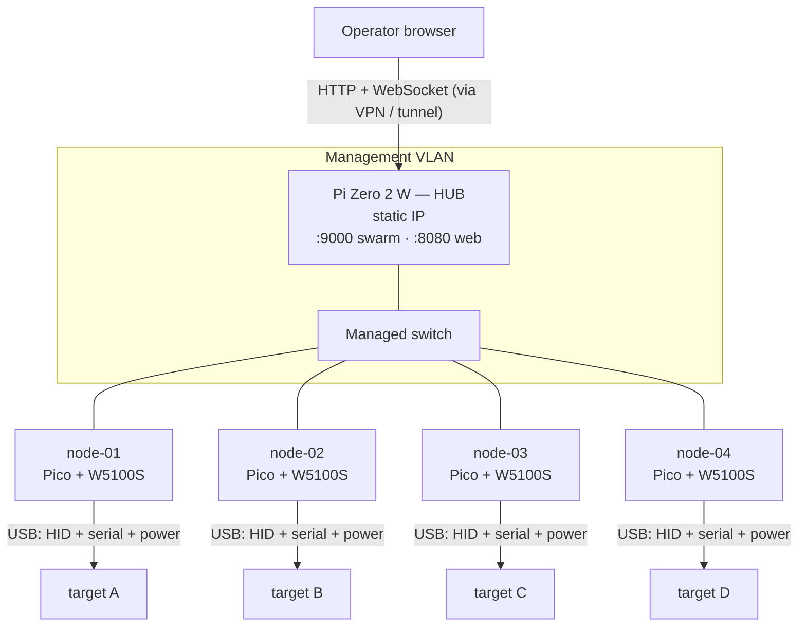
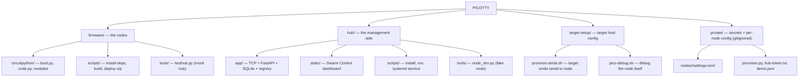

[← Docs index](README.md) · [← Project README](../README.md)

# Hardware

## Physical topology

The shape is a star. The hub sits at the center. Every node is a leaf with two
independent attachments: a USB cable to its target machine, and an Ethernet cable
to the management switch. Nothing connects node to node. Addresses below are
illustrative placeholders — use your own management subnet.

Two facts drive the whole design:

- **The node's Ethernet is on SPI, not USB.** The W5100S talks to the Pico over
  SPI, leaving the Pico's USB free to be a device presented to the target. That is
  what lets a node be a USB keyboard *and* reach the network at the same time.
- **One node per target.** No fan-out. Five machines means five nodes, five
  Ethernet drops, five IPs. The per-node cost is the real sizing driver.

Each node draws power from its target over the same USB cable that carries HID.
When the target is off, the node is off.

## Component itemization

## Bill of materials

**Per node** — one set for each target machine you want to control:

| Component | Role | Qty | Notes |
|---|---|---|---|
| **Raspberry Pi Pico** (RP2040) — *or* **Pico 2** (RP2350) | Runs the CircuitPython node firmware; enumerates on the target as a USB keyboard + serial back-channel | 1 | Pico 2 is a drop-in — identical 40-pin layout and USB; just flash the **Pico 2** CircuitPython `.uf2` and stage libs for that build. Plain (non-W) boards are fine: the node is wired, so on-board Wi-Fi/BLE goes unused. |
| **WIZnet W5100S Ethernet HAT** | Wired Ethernet to the hub over **SPI**, keeping the Pico's USB free for the target | 1 | Seats on the Pico's 40-pin header (SPI0 + reset/interrupt). Driven by `adafruit_wiznet5k`. |
| **USB cable — data-capable** | Power **and** all three USB functions to the target, over the one cable | 1 | Micro-USB for Pico, USB-C for Pico 2. A charge-only cable powers the board but carries no HID/serial — a common gotcha. |
| **Ethernet patch cable** | Node → switch, on the management segment | 1 | |

> **All-in-one alternative:** the **WIZnet W5100S-EVB-Pico** integrates an RP2040 and the W5100S on a single board — it replaces the *Pico + HAT* pair with **no firmware changes**. Use it where you'd rather not stack a HAT.

**Hub** — one, shared by the whole swarm:

| Component | Role | Qty | Notes |
|---|---|---|---|
| **Raspberry Pi Zero 2 W** | Runs the hub: FastAPI dashboard, raw-TCP node server, SQLite history | 1 | Give it a **static IP** — nodes dial it by address. 64-bit Raspberry Pi OS installs the Python wheels (uvicorn/pydantic-core) most smoothly. Any always-on Linux box works too. |
| **Wired Ethernet for the hub** | Puts the hub on the **same wired management segment as the nodes** | 1 | The Zero 2 W has **no built-in Ethernet** (only Wi-Fi). Add wired networking with an Ethernet HAT — e.g. the **Waveshare Ethernet/USB HUB HAT** (also a WIZnet W5500-based Ethernet HAT) — or a USB-OTG Ethernet adapter. See the note below. |
| **microSD card** (8 GB+) | Hub OS + the SQLite database | 1 | |
| **USB power supply** | Powers the hub | 1 | |

> **Put the hub on wired Ethernet.** The nodes reach the hub over wired Ethernet
> (SPI → RJ45), so the hub belongs on that same switched/VLAN segment. The Pi Zero
> 2 W has only Wi-Fi on-board, so give it a wired NIC: an **Ethernet HAT** such as
> the **Waveshare Ethernet/USB HUB HAT** (or any W5500/USB-Ethernet HAT), or a
> USB-OTG Ethernet dongle. Wi-Fi *works* for a bench test, but a wired hub is the
> production posture — it keeps hub↔node traffic on one isolated management
> segment and avoids Wi-Fi drops taking the whole fleet's control plane with them.

**Fabric** — shared:

| Component | Role | Notes |
|---|---|---|
| **Managed switch / isolated VLAN** | Carries node↔hub TCP on an internal segment | The network boundary is **not** an authenticator — the node token still applies on every connection. |

**Sizing:** one Pico (+ HAT) and one Ethernet drop **per target machine**. A five-node swarm is five Picos, five HATs, five IPs, plus the single hub — the per-node cost is the real sizing driver.

Your real node ids, hub address, and token live only under `private/` (gitignored)
— nothing machine-specific is committed.
