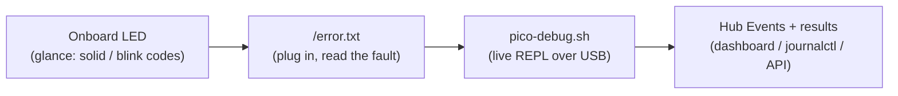

[← Docs index](README.md) · [← Project README](../README.md)

# Operations & debugging

- [Observability](#observability)
- [Prompt-state at a glance](#prompt-state-at-a-glance)
- [HID input vs. Serial input](#hid-input-vs-serial-input)
- [The console renderer](#the-console-renderer)
- [Session recording & replay](#session-recording--replay)
- [The raw serial bridge](#the-raw-serial-bridge)
- [Alerting hooks](#alerting-hooks)

## Observability

Three concentric views, from a headless node outward to the whole fleet:



- **LED** — solid = connected & healthy; slow blink = up but not connected; medium
  blink = Ethernet problem; fast blink = fatal config/HID error.
- **`/error.txt`** — opt-in (`LOG_TO_FILE = "true"`): config/HID/Ethernet errors,
  watchdog-reset boots, and crashes, readable by plugging the Pico into a computer.
  Trade-off: the drive goes read-only over USB until you re-flash CircuitPython.
- **`pico-debug.sh`** — the node's REPL over its console USB channel: live
  `print()` output, tracebacks, and an interactive prompt (Ctrl-C / Ctrl-D).
- **The hub** — once connected, the node reports home: `node_up`/`node_down`,
  heartbeats + RTT, **error** events (including "recovered from watchdog reset"),
  and every command's `ok`/`failed` result with detail. Read it in the dashboard
  **Events** view, `journalctl -u swarm-hub -f`, or `GET /api/events`.

## Prompt-state at a glance

Online/offline tells you a node is *reachable*; it doesn't tell you *where the
target is*. The hub classifies each node's serial output into a coarse
**prompt-state** — `login`, `password`, `shell`, `grub`, `panic`, or `booting` —
so a per-node badge on the dashboard shows, across the whole fleet, which boxes
sit at a login prompt, which are mid-boot, and which have panicked.

This is computed hub-side from the output stream (no firmware change): a small
ordered set of regexes runs over the freshest bytes of each node's rolling output
tail, and the first match wins. It is **live status, never persisted** — it lives
on the registry like `rtt_ms`, is `null` while a node is offline, and is exposed
read-only via `prompt_state` on `GET /api/nodes/{id}`. When it changes, the hub
broadcasts a `node_state` event to every browser, so badges update without any
console being open. The full pattern table and ordering are in
[automation.md](automation.md#prompt-state-detection) — the same matcher the
expect engine waits on.

## HID input vs. Serial input

The console tab has two input modes, toggled per node.

- **HID mode** injects USB keystrokes (`type`/`keys`/macros); they land on the
  target's keyboard console — `tty1`, BIOS, GRUB — so it is the mode for firmware
  setup, bootloaders, and any target with no serial getty.
- **Serial mode** writes bytes straight into the target's serial line (the `send`
  command) and is the mode for an interactive **Linux serial login**: with a getty
  on the node's data port, keystrokes reach the login session and the getty echoes
  them back through the same channel, so passwords mask and typed characters appear
  with no local echo.

The two are distinct sessions and line up only at BIOS/GRUB; at Linux runtime, HID
drives `tty1` while Serial drives the getty. **A common surprise:** while watching
the Serial console, HID keystrokes appear to do nothing — they are landing on
`tty1`, not the serial getty you're viewing. Serial mode is offered only for nodes
whose firmware advertises the `serial_tx` capability; older firmware shows HID only.

**Control-byte shortcuts.** Because Serial mode writes raw bytes, the common
control characters map straight onto the `send` command's `raw` (hex) field:
Ctrl-C `"03"`, Ctrl-D `"04"`, CR `"0d"`, Tab `"09"`, Esc `"1b"`, Backspace `"7f"`.
Ctrl-C interrupting a running command on the target is the canonical case.

## The console renderer

The console is fed a live text stream over the WebSocket; how it *renders* that
stream determines what you can drive from it.

The console is moving to a vendored **xterm.js** terminal so that ANSI colors,
cursor positioning, and full-screen TUIs (a distro installer, `htop`, `nano`)
render correctly instead of scrolling as garbage — which matters once Serial mode
makes the console interactive. Because the hub runs on an **isolated VLAN with no
internet**, xterm.js is not loaded from a CDN: the operator **vendors** the assets
locally. Download `xterm.js`, `xterm.css`, and the fit addon into
`hub/static/vendor/` and reference them from `index.html`. The hub side needs no
change — output already streams as text; only the client rendering changes.

Where the vendored terminal is not present, the console falls back to the original
append-only text log: terminal control sequences (colors, cursor moves) are
**stripped** at render and full-screen TUIs scroll as plain text rather than
repainting in place. Either way the raw bytes are always stored verbatim in
`output_log` — only the *display* is affected — so a recording or a downloaded log
keeps every byte the target emitted.

## Session recording & replay

`output_log` already stores every chunk with a hub-stamped timestamp, so a past
session — an install, a crash, a boot — can be replayed as it happened without any
new capture path. The hub exports it as an **asciicast v2** recording:

```
GET /api/nodes/{id}/session.cast?since=<ms>&before=<ms>&width=100&height=30
```

`since`/`before` bound the window in milliseconds on the **hub's** `received_at`
clock — the same clock as output timestamps. (Node `ts` is deliberately ignored:
the Picos have no RTC, so their timestamps are monotonic-from-boot, not
wall-clock — see [considerations.md](considerations.md).) The response is a
streamed asciicast: a `{"version":2,...}` header line followed by one
`[offset, "o", text]` event per stored chunk, offsets measured from the first row
in the window.

The `.cast` file plays in any asciinema player — the standalone
`asciinema play file.cast`, the web player, or a vendored `asciinema-player` under
`hub/static/vendor/` (same offline-vendoring reasoning as xterm.js above) wired to
a "replay" affordance that loads a chosen time window. It is read-only over
existing data: no schema change, no firmware change, no protocol change.

## The raw serial bridge

The serial channel is otherwise reachable only through the dashboard. The bridge
exposes an assigned node's serial line as a plain **TCP socket**, so any tool that
speaks a raw serial socket — `minicom`, PuTTY, `conserver`, `esptool` — attaches
to a node unchanged:

```bash
minicom -D tcp:<hub-ip>:<port>      # interactive serial to that node
```

**It is off by default and opt-in per node:**

- Enable the subsystem with the `serial_bridge_enabled` setting (Settings panel or
  `PATCH /api/settings`). Toggling it binds/unbinds listeners immediately.
- Assign a node a port: `POST /api/nodes/{id}/bridge?port=<port>` (1024–65535, not
  a hub face port, not already taken). `GET /api/bridge` lists the map and the
  bind host; `DELETE /api/nodes/{id}/bridge` removes an assignment. The map is
  durable (the `serial_bridge` table); one TCP port per node.
- On a client connection the hub pipes socket bytes → the node's serial line (a
  lightweight `send`, with no DB row per keystroke) and the node's `output` → the
  socket. A node with no `serial_tx` gets a **read-only** bridge — writes are
  dropped. A slow reader that backs up past ~1 MiB is dropped rather than stalling
  the loop, and disconnecting the socket cleanly detaches without affecting the
  dashboard's view of the same node.

**Security boundary.** The bridge is raw and unauthenticated — anything that can
reach the port gets an interactive serial session to that node. Bind it on the
management interface only: the bind host is process-level (`HUB_BRIDGE_HOST`,
default `0.0.0.0`, fine on an isolated VLAN; set it to a specific IP on a
multi-homed hub) and it must never be reachable from outside the segment. This is
the same "network isolation is the real boundary" posture as `:9000` and `:8080` —
see [considerations.md](considerations.md).

## Alerting hooks

For a fleet you stop watching the dashboard, so the hub tells you when something
matters. The audit path (`hub.audit`) is the single place every notable event
already passes through, so outbound notifications hang off it — no polling, no new
code path.

- **Off by default.** Enable `alerts_enabled` and set `alerts_webhook_url` and/or
  `alerts_ntfy_url` in Settings (`PATCH /api/settings`). A generic webhook receives
  the JSON payload; an ntfy URL receives a plain-text body.
- **Which events fire.** Three, selected out of the audit stream:
  - `node_down` — a node goes offline (disconnect or stale-sweep),
  - watchdog recovery — the "recovered from watchdog reset" `error` event a node
    sends after the loop hung and the watchdog restarted it,
  - a command `result` whose status is `failed`.
- **Dedup.** The same `(kind, node)` alert is suppressed for 60 s, so a node that
  flaps down/up every few seconds sends one alert, not a storm.
- **Never blocks the loop.** Each notification is its own asyncio task with a 5 s
  timeout and a single retry; a slow or dead endpoint can't stall the event loop,
  and a delivery that still fails is recorded as an event rather than raised.

Keep the alert endpoints reachable from the isolated segment, or route them
through the same tunnel you use for the dashboard.
