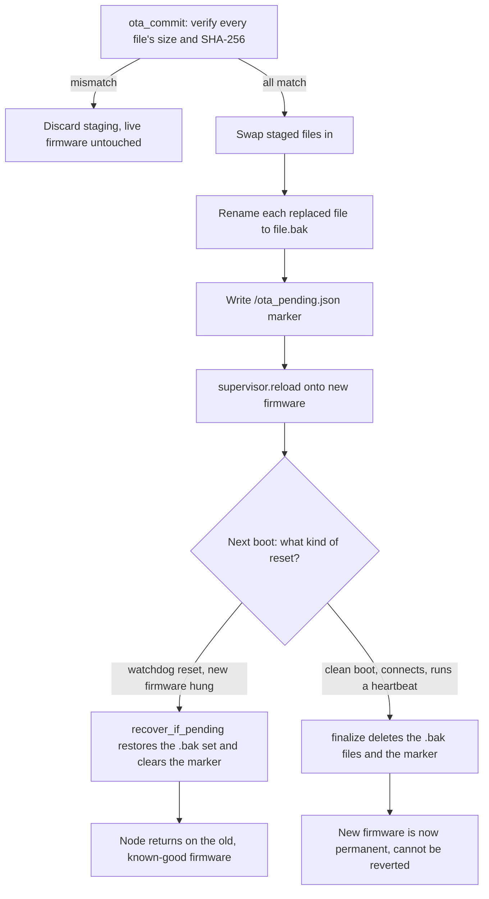
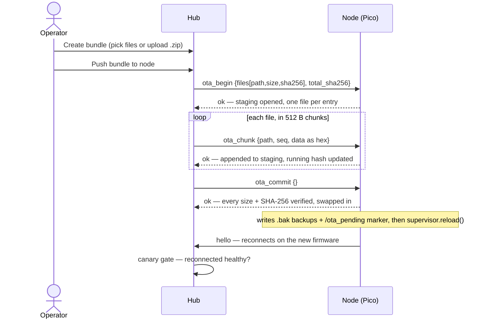
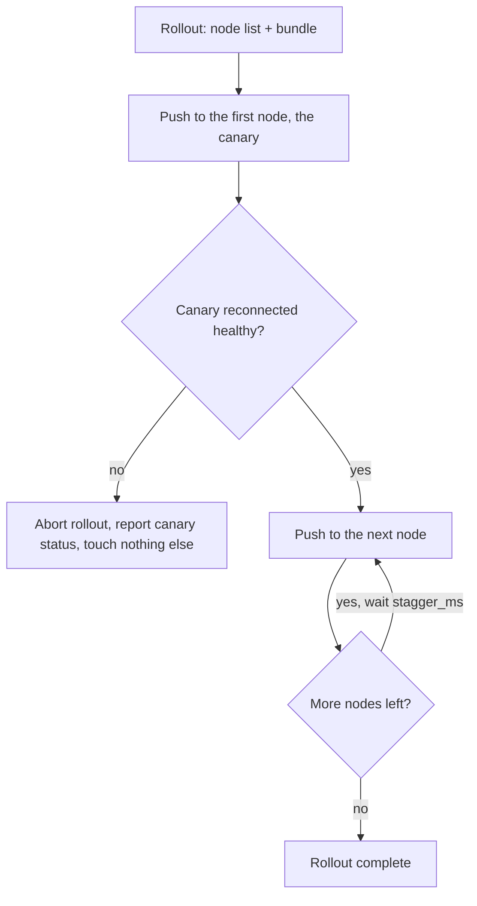

[← Docs index](README.md) · [← Project README](../README.md)

# OTA firmware updates

- [Current status](#current-status)
- [Why this is the highest-risk feature](#why-this-is-the-highest-risk-feature)
- [The safety model](#the-safety-model)
- [Creating a bundle: files or a .zip](#creating-a-bundle-files-or-a-zip)
- [The push flow](#the-push-flow)
- [Rollout posture: canary, one node at a time](#rollout-posture-canary-one-node-at-a-time)
- [The writable-filesystem trade-off](#the-writable-filesystem-trade-off)
- [When OTA fails: wipe and reflash by hand](#when-ota-fails-wipe-and-reflash-by-hand)

Updating firmware by hand means physically touching every Pico — for a rack of
nodes that is the real operational cost. CircuitPython can remount its own
filesystem writable, so a node can receive new files over the wire and reload
itself. OTA is that: a hub-driven, chunked, checksummed file push with a
known-good fallback so a bad update self-reverts.

## Current status

**OTA is fully wired, end to end.** The firmware safety machinery and the
transport wiring and the hub side are all in place:

- `firmware/circuitpython/otaflash.py` implements the staging, SHA-256
  verification, atomic-ish swap, `.bak` backup, watchdog-revert, and
  finalize-when-healthy logic described below. This is the hard, dangerous part.
- **The firmware wiring:** `code.py` imports `otaflash`, advertises the `ota`
  capability (only when `OTA_ENABLED` is on *and* the write probe + `adafruit_hashlib`
  succeed), and dispatches `ota_begin`/`ota_chunk`/`ota_commit`; it calls
  `ota.finalize()` on a healthy heartbeat. `boot.py` calls `recover_if_pending()`
  early in boot; the `OTA_ENABLED` setting exists in `nodeconfig.py` /
  `settings.toml`.
- **The hub side:** `hub/app/ota.py` provides bundle storage (under
  `hub/data/firmware/`), the per-node chunked push, and the canary rollout, with
  REST endpoints (`GET/POST /api/ota/bundles`, `POST /api/nodes/{id}/ota`,
  `GET /api/nodes/{id}/ota/{job_id}`, `POST /api/bulk/ota`).

The capability gate does exactly its job: a node that cannot safely receive OTA
(read-only filesystem, or no `adafruit_hashlib`) never advertises `ota`, so the
hub never offers it a push. This page is both the design of record for the safety
model and the operator runbook for the shipped feature.

## Why this is the highest-risk feature

A bad firmware push deploys to hardware you may not be able to reach. If an update
crash-loops a node in a rack you can't physically get to, and there is no
automatic escape, that node is bricked until someone walks to it with a laptop and
holds BOOTSEL. Every design choice below exists to make that outcome impossible
*without human help*. The rule: **build the safety rails first, and never push to
the whole fleet at once.**

## The safety model

Four rails, in order, each one covering the previous one's failure:

1. **It only runs on a writable filesystem.** OTA needs `boot.py` to have
   remounted `/` writable-to-CircuitPython — which (like `LOG_TO_FILE`) makes the
   `CIRCUITPY` drive read-only over USB, the production posture anyway (USB drive
   hidden). A node that cannot write does not advertise `ota`, so the hub never
   tries to push to it.
2. **Integrity is verified before anything is swapped.** Each file carries a size
   and a SHA-256 in the manifest; every staged file's hash and length must match
   before a single live file is touched. SHA-256 comes from `adafruit_hashlib`;
   without that library the node reports `ota` unavailable rather than trusting an
   unchecked transfer. A half-received or corrupt bundle is discarded and the live
   firmware is left exactly as it was.
3. **The swap keeps the old files and drops a pending marker.** On commit, each
   replaced file is renamed to `<file>.bak` and an `/ota_pending.json` marker is
   written listing what changed. The staged files are moved into place, then the
   node reloads.
4. **A crash-looping update reverts itself on the next reset.** `boot.py` calls
   `recover_if_pending(was_watchdog)` early in boot. If a pending marker
   exists **and this boot followed a watchdog reset** — i.e. the new firmware hung
   and the ~8 s hardware watchdog restarted the node — the `.bak` set is restored
   automatically and the marker is cleared. The node comes back on the old, known-good
   firmware without anyone touching it.

The counterpart to rail 4 is **finalize-when-healthy**: once the *new* firmware
has actually booted, connected to the hub, and run, it calls `finalize()`, which
deletes the `.bak` files and the pending marker. From that point a later,
unrelated watchdog reset can never revert a firmware that already proved it works.
So the window in which an update can auto-revert is exactly "it was just installed
and hasn't successfully run yet" — which is precisely the window you want it in.

All of `otaflash.py`'s filesystem operations swallow errors during boot recovery:
recovery must never itself raise in `boot.py` and brick a node.

The whole commit → reboot → recover-or-finalize decision, end to end:



### Path safety

A bundle path must be a plain relative path under the drive root — no leading `/`,
no `..` traversal. A hostile or malformed manifest cannot write outside
`CIRCUITPY`.

## Creating a bundle: files or a .zip

Before anything is pushed, the firmware to ship lives on the hub as a **bundle** —
a directory under `hub/data/firmware/<name>/` holding the file blobs and a
`manifest.json` (each file's path, size, and SHA-256, plus a `total_sha256`).
There are two ways to create one.

**From hand-picked files** — `POST /api/ota/bundles`:

```json
{"name": "node-01-v3", "files": [{"path": "code.py", "content_b64": "..."},
                                  {"path": "nodeconfig.py", "content_b64": "..."}]}
```

Each file is base64 in the request; the dashboard's "Manage bundles…" sheet reads
the picked files in the browser and fills this in. The name must match
`[A-Za-z0-9._-]{1,64}`.

### Uploading a bundle as a .zip

Picking files one by one is fine for a one-line patch but tedious for a whole
firmware (with `lib/` that is hundreds of files). Instead, upload the entire
firmware as a single `.zip` — `POST /api/ota/bundles/zip`:

```json
{"name": "node-01-v3", "zip_b64": "<base64 of a .zip>"}
```

`zip_b64` is the base64 of a `.zip` archive. The hub **decompresses it
server-side** and stages every entry, so the browser never has to enumerate the
files. Two conveniences make the archive "just work":

- **A single shared top-level directory is stripped.** Zipping the *folder*
  `Node-Main/` yields entries like `Node-Main/code.py`; the hub detects that every
  entry shares one leading directory and strips it, so the bundle contains
  `code.py`, not `Node-Main/code.py`. (A flat zip with no common prefix is left
  as-is.)
- **Junk entries are skipped** — `__MACOSX/`, `.DS_Store`, `boot_out.txt`,
  `Thumbs.db` are never staged.

Every path is then validated exactly like a hand-built bundle (plain relative
paths only — no leading `/`, no `..`), and the same size/count caps apply
(≤ 400 files, ≤ 1 MiB/file, ≤ 8 MiB/bundle). A malformed archive is rejected with
HTTP **422** (`bad_zip`, or `not a valid zip file`); the bundle name defaults to
the uploaded file's basename (sanitized) when the name field is blank.

**`build.sh` already produces exactly this.** Building with `--stage` writes both
`firmware/build/<node>/` and `firmware/build/<node>.zip` — that `.zip` is precisely
what the upload endpoint expects, so the normal path is: build the node artifact,
then upload its `.zip` as a bundle.

```bash
bash firmware/scripts/build.sh --node <id> --stage   # -> firmware/build/<id>.zip
#   …then upload firmware/build/<id>.zip via "Upload .zip" (or POST /api/ota/bundles/zip)
```

<p align="center">
  
  <br><sub>The per-node OTA panel: pick a bundle, push, and watch live byte-progress until the node reports healthy.</sub>
</p>

## The push flow

Once a bundle exists, pushing it to a node (`POST /api/nodes/{id}/ota`) runs the
begin → chunk → commit → reconnect flow below. Progress streams to every browser
as `ota_progress` events; poll `GET /api/nodes/{id}/ota/{job}` for a snapshot.



Three node commands carry a bundle, designed to stream without growing memory:

| Command | Payload | Node does |
|---|---|---|
| `ota_begin` | `{files: [{path, size, sha256}], total_sha256}` | Clears staging, opens an empty staging file per manifest entry. |
| `ota_chunk` | `{path, seq, data}` (`data` is hex) | Appends the chunk to that file's staging area and updates its running hash. |
| `ota_commit` | `{}` | Verifies every file's size + SHA-256, swaps in with `.bak` backups, writes the pending marker, reloads. |

Chunks are small (kept in the ~512 B–1 KB range) and written straight to a
staging file, so a large bundle never grows the heap. The cooperative loop keeps
feeding the watchdog between chunk frames exactly as it does for serial output —
filesystem writes on CircuitPython can be slow, so the work is budgeted the same
way `drain_tx` budgets serial writes.

The reload uses the same `supervisor.reload()` soft-reload path as `reboot`: it
restarts the firmware **without** re-enumerating USB, so the target keeps seeing
the node's keyboard and serial port across the update.

Any recoverable failure (bad path, size or hash mismatch, commit with no begun
bundle) is reported as a `failed` result, never a crash — the half-written staging
area is discarded and the live firmware is untouched.

## Rollout posture: canary, one node at a time

The single most important operational rule: **never flash the whole fleet in one
shot.** The hub orchestration (`POST /api/bulk/ota`) is a staged rollout with a
canary — push to one node, wait for it to reconnect on the new `fw` version and
run a clean heartbeat (i.e. prove rail 4 didn't have to fire), and only then
proceed to the next node or small batch. A bad bundle then costs you exactly one
node's auto-revert cycle, not a dark rack.



Verify the revert path deliberately before trusting it in production: push a
knowingly-broken `code.py` to a single bench node and confirm it watchdog-resets,
restores the `.bak` set, and reconnects on the old firmware on its own. Exercise
the whole flow against one node on the bench (via `firmware/tools/testhub.py`)
before any bulk path exists.

## The writable-filesystem trade-off

OTA and normal drag-drop deployment are mutually exclusive on a given boot, for
the same reason `LOG_TO_FILE` is (see
[firmware.md](firmware.md#circuitpython-version-rules)): a filesystem writable to
CircuitPython is **read-only over USB**. An OTA-capable node is one you update
*over the network* precisely because you have given up updating it *over USB* —
that is the whole point, and it is the production posture (USB drive hidden) you
would run a deployed node in anyway. A node left in host-writable mode for
bench work simply won't advertise `ota`, and that is correct.

## When OTA fails: wipe and reflash by hand

The automatic watchdog-revert (rail 4) recovers a node from a *crash-looping*
update on its own. But some failures need hands-on recovery — an OTA push that
errors out repeatedly, a bundle that boots but is wrong, a node you simply want to
re-provision. The catch is that an OTA node's `CIRCUITPY` drive is **read-only over
USB** (that is the writable-filesystem trade-off above), so you can't just drag new
files onto it or delete the old ones.

The escape hatch is **`firmware/scripts/wipe-pico.sh`**. It reaches the node over
the one channel that still works when USB is write-locked — the CircuitPython
**REPL** on the console serial port — disables the watchdog, and reformats the
filesystem (`storage.erase_filesystem()`). That returns `CIRCUITPY` to an **empty,
host-writable** drive, after which you deploy the current firmware by hand exactly
as you would a fresh board:

```bash
# 1. Wipe the write-protected node (auto-grants the serial port with sudo chmod).
bash firmware/scripts/wipe-pico.sh                 # or --dev /dev/ttyACM0
#    --files instead does a softer delete (keeps lib/); --status just shows the port.

# 2. The drive comes back empty and writable — redeploy the built firmware:
bash firmware/scripts/build.sh --node <id> --drive /run/media/$USER/CIRCUITPY
#    …or drag the contents of firmware/build/<id>/ onto CIRCUITPY, then power-cycle.
```

If the REPL can't be reached at all (no console port, or the watchdog resets the
board before the wipe lands), fall back to the guaranteed hardware path: hold
**BOOTSEL** while plugging the Pico in, then drop the CircuitPython `.uf2` (fresh
install) or Adafruit's `flash_nuke.uf2` (full erase) onto the `RPI-RP2` drive, and
redeploy. See the script's `--help` for the full manual REPL sequence
(`Ctrl-C` → `import storage; storage.erase_filesystem()`).

Nothing unique is lost in a wipe: each node's identity lives in
`private/nodes/<id>/settings.toml`, and `build.sh` re-stitches it back in on the
next deploy.
