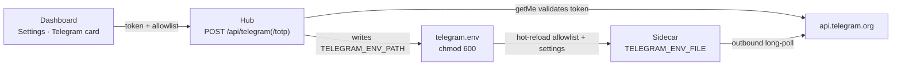

[← Docs index](README.md) · [← Project README](../README.md)

# Telegram sidecar

Reach the hub from your phone without opening the management VLAN to inbound
traffic.

## What it is

The sidecar is a **separate process** — the [`telegram-bot/`](../telegram-bot/)
uv app — not part of the hub. It reaches the hub **only** through the hub's REST
API and `/ws` event stream; it holds no hub internals. It depends on
`picotty[telegram]` and imports `picotty.client` (the `HubClient` + `HubEvents`
SDK), so it needs no repo checkout of the hub — just the installed package. How
`picotty[telegram]` is installed is in [packaging.md](packaging.md).

Telegram is used because the Bot API's **long polling is outbound-only**: the
sidecar opens one HTTPS connection *out* to `api.telegram.org` and holds it — no
inbound port, no webhook, no public endpoint. The only firewall change is an
egress allow to `api.telegram.org` from the hub host. Stopping the sidecar
removes the entire external surface with zero hub impact.

## Capability tiers

| Tier | Commands | Gate |
|---|---|---|
| **1 · Stats** | `/status` `/nodes` `/uptime [node]` | allowlist |
| **2 · Alerts** | node down/up, watchdog recovery, command failed, hub restart; `/mute` `/unmute` | allowlist |
| **3 · Terminal** | `/shell [node]`, plain text → getty, control keys (`/ctrlc` `/ctrld` `/ctrlz` `/esc` `/tab` `/enter` …), `/reboot`, `/sysrq` | allowlist **+ armed (TOTP)** |

Tier 3 rides the hub `send` command and is gated on the node advertising
`serial_tx`. The full command reference is in
[../telegram-bot/README.md](../telegram-bot/README.md).

## Security model

- **Chat-ID allowlist**, checked on *every* update — not just at session start.
  Unknown chats get **silence** (logged), never a reply.
- **Break-glass arming** for tier 3. The allowlist alone isn't enough: a
  compromised phone would otherwise hold shell access. `/arm <TOTP>` arms the
  shell for a bounded window, then it **auto-disarms**; an **idle timeout** ends
  a forgotten session; a replayed code is rejected. Stats and alerts are always
  on — only `/shell`, `/reboot`, `/sysrq` require armed.
- **Passwords stay out of chat**: the getty doesn't echo, so nothing sensitive
  is relayed back (your *typed* commands are still in chat history — deleting
  them is on you).
- **Sidecar-local audit log**: chat id, command, node, outcome, and every line
  typed into a target, append-only, chmod 600 — kept sidecar-local so the bot
  needs no hub write endpoint. The bot token and TOTP secret are never logged.
- **Kill switch**: `systemctl stop` the sidecar unit removes the whole external
  surface at once.
- **Egress**: allow the hub host outbound 443 to `api.telegram.org` only.

## Dashboard setup flow

The sidecar's credentials are provisioned from the dashboard, so nothing
sensitive is typed at a shell. **Settings → the "Telegram sidecar" card** writes
the sidecar's env file *via the hub*:

- **`POST /api/telegram`** — validates the bot token against Telegram
  (`getMe`) before saving, and writes the allowlist + shell/alert settings.
- **`POST /api/telegram/totp`** — generates a base32 TOTP secret and returns an
  `otpauth://` URI (render it as a QR for the authenticator app).

The bot token and the TOTP secret are **write-only**: submitted through the card,
never shown back after.

The hub writes the file at **`TELEGRAM_ENV_PATH`** (default
`~/.config/picotty/telegram.env`) at **chmod 600**. The sidecar reads the same
file via **`TELEGRAM_ENV_FILE`** and **hot-reloads** the allowlist and the
shell/alert settings whenever it changes — no restart. The one exception: a **bot
token change needs a sidecar restart** (and is logged).

> When the hub and sidecar are co-located, point `TELEGRAM_ENV_PATH` (hub) and
> `TELEGRAM_ENV_FILE` (sidecar) at the **same path** — the hub writes it, the
> sidecar reads it, hot-reload does the rest.

