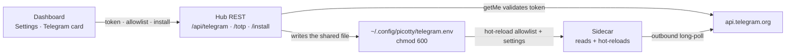

[← Docs index](README.md) · [← Project README](../README.md)

# Telegram sidecar

Reach the hub from your phone without opening the management VLAN to inbound
traffic.

## What it is

The sidecar is a **separate process** — the [`telegram-bot/`](../telegram-bot/)
uv app — not part of the hub. It reaches the hub **only** through the hub's REST
API and `/ws` event stream; it holds no hub internals. It depends on
`picotty[telegram]` and imports `picotty.client` (the `HubClient` + `HubEvents`
SDK), so it needs no repo checkout of the hub — just the installed package. How
`picotty[telegram]` is installed is in [packaging.md](packaging.md).

Telegram is used because the Bot API's **long polling is outbound-only**: the
sidecar opens one HTTPS connection *out* to `api.telegram.org` and holds it — no
inbound port, no webhook, no public endpoint. The only firewall change is an
egress allow to `api.telegram.org` from the hub host. Stopping the sidecar
removes the entire external surface with zero hub impact.

## Setup

Two ways to bring the sidecar up on the hub host. Both end at the **same
credentials file** — `~/.config/picotty/telegram.env` — which the dashboard
writes and the sidecar reads and hot-reloads. No path to align by hand.

**A · From the dashboard (recommended).** In **Settings → the "Telegram sidecar"
card**:

1. Create a bot with [@BotFather](https://t.me/BotFather) and paste the **token**.
2. Add your numeric **chat id** (get it from [@userinfobot](https://t.me/userinfobot)).
3. For the shell tier, click **Generate** for a TOTP secret and add it to an
   authenticator app — or turn "Enable shell tier" off for stats + alerts only.
4. **Save** — the hub validates the token via `getMe` and writes the file.
5. Click **Install / start sidecar** — the hub runs the installer (`uv sync` +
   the shared `.env`) and enables the service, streaming the output into the card.
   The card's status line then reads **sidecar running**.

The install button's service step needs passwordless sudo on the hub (typical on
Raspberry Pi OS); if that isn't set up, the output panel prints the one command to
run by hand.

**B · From the shell.**

```bash
bash telegram-bot/scripts/install.sh          # uv venv + the shared ~/.config/picotty/telegram.env
# fill that file in — by hand, or from the dashboard card above
bash telegram-bot/scripts/run.sh              # foreground test
bash telegram-bot/scripts/install-service.sh  # systemd unit (starts on boot)
```

Then in Telegram: `/status`, `/nodes`, `/uptime`, and — after `/arm <code>` —
`/shell <node>`.

> **After a `git pull` that changes hub code, restart the hub** —
> `sudo systemctl restart swarm-hub` — or new REST routes (like the install
> endpoint) return `405 Method Not Allowed`. The dashboard's static files update
> live, but the Python server is loaded into memory at start.

## Capability tiers

| Tier | Commands | Gate |
|---|---|---|
| **1 · Stats** | `/status` `/nodes` `/uptime [node]` | allowlist |
| **1b · Read-only** | `/events [n]` (recent audit), `/log <node> [lines]` (recent console), `/search <text>` (search console history), `/ping <node>` (active RTT), `/hubs`, `/source [primary\|backup]`, `/macros`, `/runbooks` | allowlist |
| **2 · Alerts** | node down/up, watchdog recovery, command failed, hub restart; `/mute` `/unmute` | allowlist |
| **3 · Terminal** | `/shell [node]`, plain text → getty, control keys (`/ctrlc` `/ctrld` `/ctrlz` `/esc` `/tab` `/enter` …), `/reboot`, `/sysrq` | allowlist **+ armed (TOTP)** |
| **3b · Fleet** | `/bulk <text>` (type into every online node), `/runmacro <id> [node …]`, `/runbook <id> <node …\|all\|group:NAME>`, `/hub <node> …` | allowlist **+ armed (TOTP)** |

Tier 3 rides the hub `send` command and is gated on the node advertising
`serial_tx`. The read-only and fleet commands are thin wrappers over existing hub
REST — nothing new on the hub. Fleet commands touch many boards at once, so they
sit behind the same break-glass arming as the shell. The full command reference is
in [../telegram-bot/README.md](../telegram-bot/README.md).

### Dual-hub commands

With a [backup hub](dual-hub.md) configured, more commands surface which hub each
board is on, pick which hub the bot acts on, and let you steer a board:

- **`/hubs`** (allowlist) — list every board and the hub it's currently connected
  to (its `via <label>`).
- **`/source [primary|backup]`** (allowlist) — pick which hub the bot **acts on**.
  With no argument it shows the two hubs and which is active; `/source primary` /
  `/source backup` switch the bot to that hub. This is the bot's own source/fleet
  selection — distinct from `/hub <node> …`, which steers an individual board
  between hubs.
- **`/hub <node> <switch|prefer|pin|unpin> [target]`** (armed) — steer a board:
  move it now (`switch`), make a hub its home (`prefer`), lock it (`pin`), or
  release a pin (`unpin`). It maps to `POST /api/nodes/{id}/hub`; because it
  redirects control of a board, it is armed / break-glass gated like the shell.
  See [dual-hub.md](dual-hub.md) for the model.

### Dual-hub

The sidecar is dual-hub aware so the phone control plane survives a hub outage.
Give it a backup hub with **`HUB_BASE_URL_BACKUP`** and every REST call and the
live event stream prefer the primary, failing over to the backup when the primary
is unreachable. **`/source`** switches which hub the bot acts on (it still
auto-fails-over afterward).

Telegram allows only **one active receiver per bot token**, so HA is run the
**same** bot on both hosts with only **one enabled** (systemctl) and the other a
hot spare you promote by hand if the first host dies. The live bot already reaches
both hubs, so a single active bot covers the whole fleet. See
[dual-hub.md](dual-hub.md#the-telegram-sidecar-in-a-dual-hub-setup) for the setup.

## Security model

- **Chat-ID allowlist**, checked on *every* update — not just at session start.
  Unknown chats get **silence** (logged), never a reply.
- **Break-glass arming** for tier 3. The allowlist alone isn't enough: a
  compromised phone would otherwise hold shell access. `/arm <TOTP>` arms the
  shell for a bounded window, then it **auto-disarms**; an **idle timeout** ends
  a forgotten session; a replayed code is rejected. Stats, read-only lookups, and
  alerts are always on — the shell (`/shell`, `/reboot`, `/sysrq`) and the fleet
  actions (`/bulk`, `/runmacro`, `/runbook`, `/hub`) require armed.
- **Passwords stay out of chat**: the getty doesn't echo, so nothing sensitive
  is relayed back (your *typed* commands are still in chat history — deleting
  them is on you).
- **Sidecar-local audit log**: chat id, command, node, outcome, and every line
  typed into a target, append-only, chmod 600 — kept sidecar-local so the bot
  needs no hub write endpoint. The bot token and TOTP secret are never logged.
- **Kill switch**: `systemctl stop` the sidecar unit removes the whole external
  surface at once.
- **Egress**: allow the hub host outbound 443 to `api.telegram.org` only.

## How the credential file works

The sidecar's credentials are provisioned from the dashboard, so nothing
sensitive is typed at a shell. **Settings → the "Telegram sidecar" card** drives
the hub's REST layer:

- **`POST /api/telegram`** — validates the bot token against Telegram (`getMe`)
  before saving, then writes the token, allowlist, and shell/alert settings.
- **`POST /api/telegram/totp`** — generates a base32 TOTP secret and returns an
  `otpauth://` URI (render it as a QR for the authenticator app).
- **`POST /api/telegram/install`** — the **Install / start sidecar** button: runs
  the sidecar's own installer on the hub (`uv sync` + the shared `.env`) and
  enables its systemd service, returning the captured output.
- **`GET /api/telegram`** — the card's status: whether it's configured, the bot
  username (via `getMe`), the chat count, and **`service_active`** (sidecar
  running/stopped). Never returns the token or the TOTP secret — both are
  **write-only**.

**One file, no alignment needed.** Both the hub (`TELEGRAM_ENV_PATH`) and the
sidecar (`TELEGRAM_ENV_FILE`) default to the same path, **`~/.config/picotty/
telegram.env`** (chmod 600) — `install.sh` standardizes on it. The sidecar
**hot-reloads** the allowlist and shell/alert settings whenever the file changes,
with no restart. The one exception: a **bot-token change needs a sidecar restart**
(python-telegram-bot binds the token at start), and the sidecar logs that it's
required. A legacy in-repo `telegram-bot/.env` still works as a fallback and is
migrated on the next `install.sh`.


