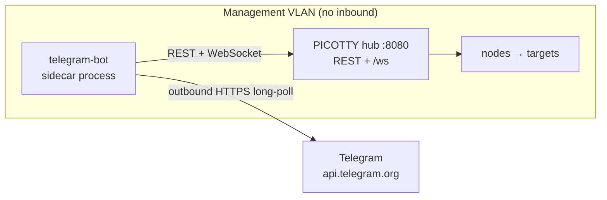

[← Project README](../README.md)

# PICOTTY Telegram sidecar

Reach the hub from your phone without opening the management VLAN to inbound
traffic. This is a **separate process** (its own venv, its own systemd unit) that
talks to the hub **only** through the existing REST API and `/ws` event stream on
`:8080`. It holds no hub internals; stopping it removes the entire external
surface with zero hub impact — the kill switch.

Why Telegram: the Bot API's **long polling is outbound-only**. The sidecar opens
one HTTPS connection *out* to `api.telegram.org` and holds it — no inbound port,
no webhook, no public endpoint. The only firewall change is an egress allow to
`api.telegram.org` from the hub host.

> **Not end-to-end encrypted.** Bot traffic is TLS to Telegram's servers, which
> can read it. Fine for uptime numbers; for the shell tier this is the reason the
> terminal is gated behind break-glass TOTP arming and the getty keeps autologin
> off.

## Capability tiers

| Tier | Commands | Gate |
|---|---|---|
| **1 · Stats** | `/status` `/nodes` `/uptime [node]` `/telemetry [node]` | allowlist |
| **1b · Read-only** | `/events [n]` (recent audit), `/log <node> [lines]` (recent console), `/search <text>` (search console history), `/ping <node>` (active RTT), `/hubs`, `/source [primary\|backup]`, `/macros`, `/runbooks` | allowlist |
| **2 · Alerts** | node offline/online, watchdog recovery, command failed, hub restart; `/mute` `/unmute` | allowlist |
| **3 · Terminal** | `/shell [node]`, plain text → getty, `/ctrlc` `/ctrld` `/ctrlz` `/esc` `/tab` `/enter` `/up` `/down` `/left` `/right`, `/reboot`, `/sysrq` | allowlist **+ armed (TOTP)** |
| **3b · Fleet** | `/bulk <text>` (type into every online node), `/runmacro <id> [node …]`, `/runbook <id> <node …\|all\|group:NAME>`, `/hub <node> <switch\|prefer\|pin\|unpin> [target]` | allowlist **+ armed (TOTP)** |

Tier 3 is built on the hub `send` command and is **gated on the node advertising
`serial_tx`** — a node whose firmware can't write serial won't open a session. The
read-only and fleet commands are thin wrappers over existing hub REST; the fleet
commands touch many boards at once, so they sit behind the same break-glass arming
as the shell. `/hubs`, `/source`, and `/hub` cover [dual-hub
failover](../docs/dual-hub.md) — which hub each board is on, which hub the bot
acts on, and steering a board to the other hub.

## Security model

- **Chat-ID allowlist**, checked on *every* update, not just at session start.
  Unknown chats get **silence** (logged to the audit file), never a reply.
- **Break-glass arming** for tier 3. The allowlist alone isn't enough — a
  compromised phone or Telegram account would otherwise hold shell access. `/arm
  <TOTP>` arms the shell for a bounded window (`SHELL_ARM_WINDOW_S`, default 1 h),
  then it auto-disarms. The shell (`/shell`, `/reboot`, `/sysrq`) and the fleet
  actions (`/bulk`, `/runmacro`, `/runbook`, `/hub`) all require armed. Stats,
  read-only lookups, and alerts are always on. An immediate TOTP replay is
  rejected.
- **Idle auto-close** (`SHELL_IDLE_TIMEOUT_S`, default 5 min) ends a forgotten
  session; a mid-session disarm closes it too.
- **Password entry is safe for free**: the getty doesn't echo, so nothing
  sensitive is relayed. Your *typed commands* are visible in Telegram chat
  history, though — deleting them after is on you.
- **Audit log**: `data/telegram-audit.jsonl` (chmod 600, append-only) records
  chat id, command, node, and outcome — including session open/close and every
  line typed into a target. Kept sidecar-local so the bot needs no hub write
  endpoint (Option B isolation); the token and TOTP secret are never logged.
- **Sidecar kill switch**: `systemctl stop swarm-telegram`.
- **Egress**: allow the hub host outbound 443 to `api.telegram.org` only.

## Rate limits

The bot uses python-telegram-bot's `AIORateLimiter`, which honors Telegram's
`retry_after` on 429 automatically. Relayed terminal output is **coalesced** in a
~1.6 s window and flushed as monospace blocks split at Telegram's 4096-char
limit; under sustained output (boot logs at 115200 baud ≈ 11.5 KB/s) the pump
**drops to summarized delivery** — it keeps the tail and notes how many bytes it
skipped — so a `dmesg -w` can't blow past the per-chat limit.

## Setup

The sidecar and the hub share **one** credentials file —
`~/.config/picotty/telegram.env` (chmod 600) — which the dashboard writes and the
sidecar reads and **hot-reloads**. Nothing to align by hand.

**From the dashboard (recommended).** Open **Settings → the "Telegram sidecar"
card**: paste the bot token (from [@BotFather](https://t.me/BotFather)), your
numeric chat id (from [@userinfobot](https://t.me/userinfobot)), and — for the
shell tier — click **Generate** for a TOTP secret and add it to an authenticator
app. **Save** (the hub validates the token via `getMe`), then **Install / start
sidecar** (the hub runs `uv sync` and enables the service, showing the output).

**From the shell.**

```bash
bash telegram-bot/scripts/install.sh          # uv venv + the shared ~/.config/picotty/telegram.env
# fill that file in — by hand, or from the dashboard card above
bash telegram-bot/scripts/run.sh              # foreground (dev)
bash telegram-bot/scripts/install-service.sh  # systemd unit (starts on boot)
```

Then in Telegram: `/status`, `/nodes`, `/uptime`, `/telemetry`, and — after `/arm <code>` —
`/shell <node>`. The full walkthrough (with the security model and the credential
flow) is in **[../docs/telegram.md](../docs/telegram.md)**.

> After a `git pull` that changes hub code, `sudo systemctl restart swarm-hub` so
> new REST routes take effect (otherwise the install endpoint returns 405).

## Dual-hub

Set **`HUB_BASE_URL_BACKUP`** in `telegram.env` and the bot fails over between
hubs — every REST call and the live event stream prefer the primary and switch to
the backup when the primary is down. **`/source [primary|backup]`** picks which
hub the bot acts on (it still auto-fails-over afterward).

Telegram allows only **one active receiver per bot token**, so for HA run the
**same** bot on both hosts but keep only **one enabled** (systemctl) — the other
is a hot spare you promote by hand if the first host dies. Full model and setup:
**[../docs/dual-hub.md](../docs/dual-hub.md)**.

## Testing without Telegram

```bash
cd telegram-bot
uv run python tests/test_unit.py     # config, TOTP arm/replay, chunking, ANSI, roster
uv run python tests/smoke.py         # builds the whole app (wiring), no network
```

The unit tests cover config parsing, TOTP arming/replay, output chunking and the
summarize fallback, ANSI stripping, and the node roster rendering — none of which
need a live bot or hub.

## What runs where


